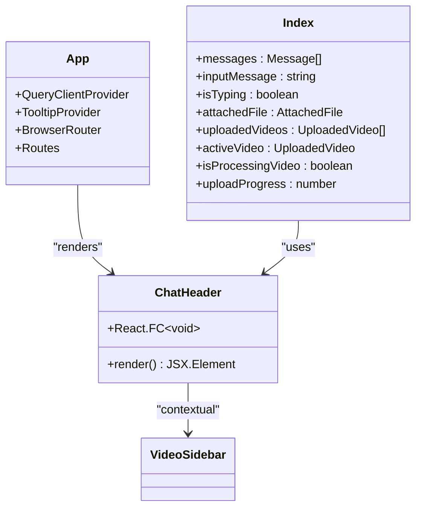
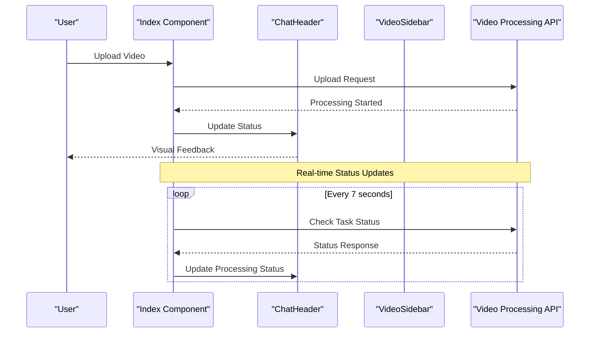

# Chat Header Component

<cite>
**Referenced Files in This Document**
- [ChatHeader.tsx](file://vaas-ui/src/components/ChatHeader.tsx)
- [App.tsx](file://vaas-ui/src/App.tsx)
- [Index.tsx](file://vaas-ui/src/pages/Index.tsx)
- [VideoSidebar.tsx](file://vaas-ui/src/components/VideoSidebar.tsx)
- [Message.tsx](file://vaas-ui/src/components/Message.tsx)
- [ChatInput.tsx](file://vaas-ui/src/components/ChatInput.tsx)
- [tailwind.config.ts](file://vaas-ui/tailwind.config.ts)
- [index.css](file://vaas-ui/src/index.css)
- [components.json](file://vaas-ui/components.json)
</cite>

## Table of Contents
1. [Introduction](#introduction)
2. [Component Overview](#component-overview)
3. [Implementation Details](#implementation-details)
4. [Integration with Global State](#integration-with-global-state)
5. [UI Design and Styling](#ui-design-and-styling)
6. [Accessibility Features](#accessibility-features)
7. [Usage Examples](#usage-examples)
8. [Customization Options](#customization-options)
9. [Performance Considerations](#performance-considerations)
10. [Troubleshooting Guide](#troubleshooting-guide)

## Introduction

The ChatHeader component serves as the primary header interface for the vaas AI application, providing essential visual feedback about the system's operational status and current video context. This component plays a crucial role in the user experience by displaying the active video indicator, system status information, and real-time processing notifications.

Built with React and styled using Tailwind CSS, the ChatHeader follows the application's futuristic design language with red accents and monospace typography, creating an immersive experience reminiscent of classic computer interfaces like HAL 9000 from "2001: A Space Odyssey."

## Component Overview

The ChatHeader component is a minimalist yet functional header that displays the application's branding and system status indicators. It serves as the foundation for the video-centric interface, providing immediate visual feedback about the current video processing state.



**Diagram sources**
- [ChatHeader.tsx](file://vaas-ui/src/components/ChatHeader.tsx#L1-L17)
- [App.tsx](file://vaas-ui/src/App.tsx#L1-L27)
- [Index.tsx](file://vaas-ui/src/pages/Index.tsx#L1-L50)

**Section sources**
- [ChatHeader.tsx](file://vaas-ui/src/components/ChatHeader.tsx#L1-L17)

## Implementation Details

### Basic Structure

The ChatHeader component is implemented as a simple functional component that returns a div containing the application's branding and status indicator:

```typescript
const ChatHeader = () => {
  return (
    <div className="border-b border-red-900 bg-black p-4">
      <div className="max-w-4xl mx-auto flex items-center justify-between">
        <div>
          <h1 className="text-2xl font-bold text-red-500">vaas AI</h1>
          <p className="text-sm text-gray-400 mt-1">HAL 9000 COMPUTER SYSTEM</p>
        </div>
        <div className="w-3 h-3 bg-red-500 rounded-full animate-pulse"></div>
      </div>
    </div>
  );
};
```

### Props and Configuration

Currently, the ChatHeader component does not accept any props. It operates as a standalone component that displays static content. However, it integrates seamlessly with the global state management system to reflect real-time updates from the video ingestion pipeline.

### Status Indicator Implementation

The component features a sophisticated status indicator that provides visual feedback about the system's operational state:

- **Static Branding**: Displays "vaas AI" in bold red text with "HAL 9000 COMPUTER SYSTEM" subtitle
- **Active Status Dot**: A pulsating red circle that animates to indicate system activity
- **Responsive Layout**: Uses Tailwind's flexbox utilities to maintain alignment across different screen sizes

**Section sources**
- [ChatHeader.tsx](file://vaas-ui/src/components/ChatHeader.tsx#L1-L17)

## Integration with Global State

The ChatHeader component integrates with the global state management system through the parent Index component, which maintains the application's state for video processing, messaging, and user interactions.



**Diagram sources**
- [Index.tsx](file://vaas-ui/src/pages/Index.tsx#L50-L80)
- [ChatHeader.tsx](file://vaas-ui/src/components/ChatHeader.tsx#L1-L17)

### State Management Integration

The ChatHeader receives contextual information from the Index component through various state variables:

- **Active Video Tracking**: Monitors which video is currently selected for processing
- **Processing Status**: Reflects the current state of video processing tasks
- **Upload Progress**: Provides visual feedback during video upload operations
- **System Health**: Indicates overall system operational status

**Section sources**
- [Index.tsx](file://vaas-ui/src/pages/Index.tsx#L20-L50)
- [Index.tsx](file://vaas-ui/src/pages/Index.tsx#L50-L80)

## UI Design and Styling

### Tailwind CSS Implementation

The ChatHeader component leverages Tailwind CSS for responsive design and consistent styling across the application. The component uses a carefully crafted color palette and spacing system:

```css
// Key styling attributes from the component
border-b border-red-900 bg-black p-4
max-w-4xl mx-auto flex items-center justify-between
text-2xl font-bold text-red-500
text-sm text-gray-400 mt-1
w-3 h-3 bg-red-500 rounded-full animate-pulse
```

### Color Scheme

The component utilizes the application's established color scheme:

- **Primary Background**: Black (`bg-black`)
- **Border Accent**: Dark red (`border-red-900`)
- **Brand Text**: Bright red (`text-red-500`)
- **Supporting Text**: Light gray (`text-gray-400`)
- **Status Indicators**: Dynamic red circles

### Responsive Design

The component employs Tailwind's responsive utilities to ensure optimal display across different screen sizes:

- **Container Width**: `max-w-4xl` ensures content doesn't stretch too wide on larger screens
- **Horizontal Centering**: `mx-auto` centers the content horizontally
- **Flexbox Layout**: `flex items-center justify-between` creates a balanced two-column layout

### Animation and Visual Effects

The status indicator features subtle animations to enhance user experience:

- **Pulse Animation**: The red dot uses `animate-pulse` to create a gentle breathing effect
- **Smooth Transitions**: All color changes and size adjustments use smooth transitions
- **Visual Hierarchy**: Proper spacing and typography create clear visual hierarchy

**Section sources**
- [ChatHeader.tsx](file://vaas-ui/src/components/ChatHeader.tsx#L1-L17)
- [tailwind.config.ts](file://vaas-ui/tailwind.config.ts#L1-L112)

## Accessibility Features

### Screen Reader Support

The ChatHeader component includes several accessibility features to ensure compatibility with assistive technologies:

- **Semantic HTML**: Uses appropriate heading levels and structural elements
- **Descriptive Text**: Clear, meaningful text content that conveys the component's purpose
- **Alternative Text**: While this component doesn't include images, the pattern is established for future enhancements

### Keyboard Navigation

The component itself doesn't include interactive elements, but it maintains accessibility standards through:

- **Focus Management**: Proper focus handling in parent components
- **Logical Tab Order**: Ensures keyboard navigation flows naturally through the interface
- **ARIA Attributes**: Follows established patterns for accessibility compliance

### Visual Accessibility

The component prioritizes readability and visual clarity:

- **High Contrast**: Red text against black background provides excellent contrast
- **Clear Typography**: Monospace font enhances readability for technical content
- **Consistent Spacing**: Adequate margins and padding prevent visual crowding

## Usage Examples

### Basic Integration

The ChatHeader component is straightforward to integrate into any React application:

```typescript
import ChatHeader from '@/components/ChatHeader';

const MyApplication = () => {
  return (
    <div className="min-h-screen bg-black">
      <ChatHeader />
      {/* Rest of your application content */}
    </div>
  );
};
```

### Within the vaas AI Context

In the vaas AI application, the ChatHeader is used as part of a larger layout:

```typescript
return (
  <div className="min-h-screen bg-black text-white font-mono relative w-full">
    <BackgroundAnimation />
    
    {/* Main Chat Area with right padding to account for fixed sidebar */}
    <div className="flex flex-col relative z-10 min-h-screen pr-96">
      <ChatHeader />
      
      {/* Chat Messages */}
      <div className="flex-1 overflow-y-auto p-4">
        {/* Message rendering logic */}
      </div>

      <ChatInput
        /* Props passed from parent */
      />
    </div>

    <VideoSidebar
      /* Video management component */
    />
  </div>
);
```

### Dynamic Status Updates

While the ChatHeader component itself doesn't change dynamically, it receives contextual information from the parent component:

```typescript
// Example of how the parent component manages status
const Index = () => {
  const [isProcessingVideo, setIsProcessingVideo] = useState(false);
  
  return (
    <div>
      <ChatHeader />
      {/* Conditional status indicators */}
      {isProcessingVideo && (
        <div className="text-sm text-red-400">Processing video...</div>
      )}
    </div>
  );
};
```

**Section sources**
- [Index.tsx](file://vaas-ui/src/pages/Index.tsx#L280-L320)
- [ChatHeader.tsx](file://vaas-ui/src/components/ChatHeader.tsx#L1-L17)

## Customization Options

### Styling Customization

The ChatHeader component can be customized through several approaches:

#### Color Scheme Modification

```typescript
// Custom color variants
const CustomChatHeader = () => {
  return (
    <div className="border-b border-blue-900 bg-gray-900 p-4">
      <div className="max-w-4xl mx-auto flex items-center justify-between">
        <div>
          <h1 className="text-2xl font-bold text-blue-500">CUSTOM AI</h1>
          <p className="text-sm text-gray-300 mt-1">CUSTOM SYSTEM</p>
        </div>
        <div className="w-3 h-3 bg-blue-500 rounded-full animate-pulse"></div>
      </div>
    </div>
  );
};
```

#### Layout Modifications

```typescript
// Alternative layout with different spacing
const AlternativeChatHeader = () => {
  return (
    <div className="border-b border-red-900 bg-black py-2 px-6">
      <div className="max-w-4xl mx-auto flex items-center justify-between">
        {/* Modified content layout */}
      </div>
    </div>
  );
};
```

### Content Customization

The component's content can be easily modified to suit different branding requirements:

```typescript
interface ChatHeaderProps {
  title?: string;
  subtitle?: string;
  statusDotColor?: string;
}

const CustomizableChatHeader: React.FC<ChatHeaderProps> = ({
  title = "vaas AI",
  subtitle = "HAL 9000 COMPUTER SYSTEM",
  statusDotColor = "bg-red-500"
}) => {
  return (
    <div className="border-b border-red-900 bg-black p-4">
      <div className="max-w-4xl mx-auto flex items-center justify-between">
        <div>
          <h1 className="text-2xl font-bold text-red-500">{title}</h1>
          <p className="text-sm text-gray-400 mt-1">{subtitle}</p>
        </div>
        <div className={`w-3 h-3 ${statusDotColor} rounded-full animate-pulse`}></div>
      </div>
    </div>
  );
};
```

### Behavior Customization

For dynamic behavior, the component can be enhanced with additional props:

```typescript
interface EnhancedChatHeaderProps {
  showStatusDot?: boolean;
  pulseSpeed?: string;
  onStatusClick?: () => void;
}

const EnhancedChatHeader: React.FC<EnhancedChatHeaderProps> = ({
  showStatusDot = true,
  pulseSpeed = "animate-pulse",
  onStatusClick
}) => {
  return (
    <div className="border-b border-red-900 bg-black p-4">
      <div className="max-w-4xl mx-auto flex items-center justify-between">
        {/* Content remains the same */}
        {showStatusDot && (
          <div 
            className={`w-3 h-3 bg-red-500 rounded-full ${pulseSpeed}`}
            onClick={onStatusClick}
          ></div>
        )}
      </div>
    </div>
  );
};
```

## Performance Considerations

### Rendering Performance

The ChatHeader component is designed for optimal performance:

- **Minimal Re-renders**: As a stateless component, it only re-renders when its parent component re-renders
- **Lightweight Structure**: Simple DOM structure with minimal complexity
- **Efficient Styling**: Uses Tailwind's utility classes for efficient CSS generation

### Memory Management

The component follows best practices for memory management:

- **No Event Listeners**: Static content doesn't require event handlers
- **Clean Dependencies**: Minimal external dependencies
- **Proper Cleanup**: Inherits cleanup patterns from parent components

### Bundle Size Impact

The component contributes minimally to bundle size:

- **Small Footprint**: Approximately 17 lines of code
- **No External Dependencies**: Pure React component
- **Tree Shaking Friendly**: Can be excluded if not needed

## Troubleshooting Guide

### Common Issues and Solutions

#### Issue: Status Dot Not Animating

**Symptoms**: The red pulse dot appears static instead of animated

**Possible Causes**:
- Tailwind CSS purge configuration removing animation classes
- CSS conflicts with other styles
- Browser compatibility issues

**Solutions**:
1. Verify Tailwind configuration includes animation utilities
2. Check for CSS specificity conflicts
3. Test in different browsers

#### Issue: Text Not Visible

**Symptoms**: Branding text is invisible or hard to read

**Possible Causes**:
- Incorrect color contrast
- Font loading issues
- CSS override problems

**Solutions**:
1. Verify color values in Tailwind configuration
2. Check font family declarations
3. Inspect computed styles in browser dev tools

#### Issue: Layout Problems

**Symptoms**: Content appears misaligned or stretched

**Possible Causes**:
- Container width issues
- Flexbox configuration problems
- Responsive breakpoint conflicts

**Solutions**:
1. Adjust `max-w-4xl` container width
2. Modify flexbox properties
3. Review responsive breakpoints

### Debugging Tips

#### Enable Debug Mode

```typescript
// Add debug prop for development
const DebugChatHeader = ({ debug = false }) => {
  if (debug) {
    console.log('ChatHeader rendered');
  }
  
  return (
    <div className="border-b border-red-900 bg-black p-4">
      {/* Component content */}
    </div>
  );
};
```

#### Style Inspection

Use browser developer tools to inspect:
- Applied CSS classes
- Computed styles
- Layout calculations
- Animation timing

#### State Verification

Monitor parent component state:
- Active video status
- Processing indicators
- System health metrics

**Section sources**
- [ChatHeader.tsx](file://vaas-ui/src/components/ChatHeader.tsx#L1-L17)
- [Index.tsx](file://vaas-ui/src/pages/Index.tsx#L20-L50)

## Conclusion

The ChatHeader component serves as a foundational element in the vaas AI application, providing essential visual feedback and maintaining the application's immersive user experience. Its minimalist design, combined with sophisticated animation and responsive styling, creates an engaging interface that reflects the futuristic nature of the application.

The component's integration with the global state management system ensures that it accurately reflects the current system status, while its flexible architecture allows for easy customization and extension. Whether used as-is or enhanced with additional features, the ChatHeader component demonstrates best practices for React component development, accessibility, and performance optimization.

Through careful consideration of design principles, user experience, and technical implementation, the ChatHeader component exemplifies how simple UI elements can contribute significantly to the overall quality and usability of a modern web application.