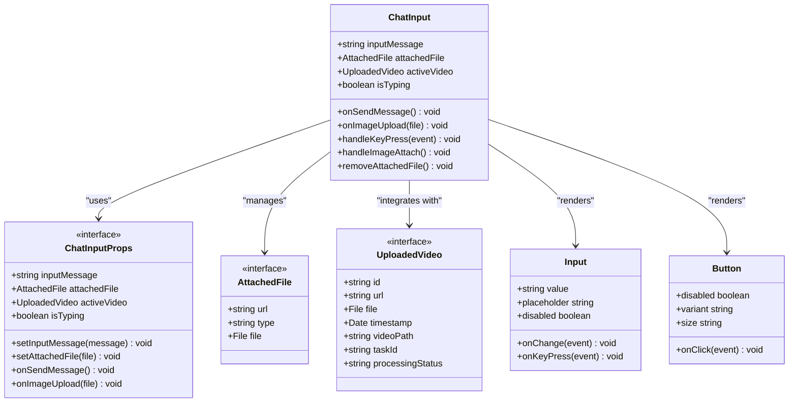
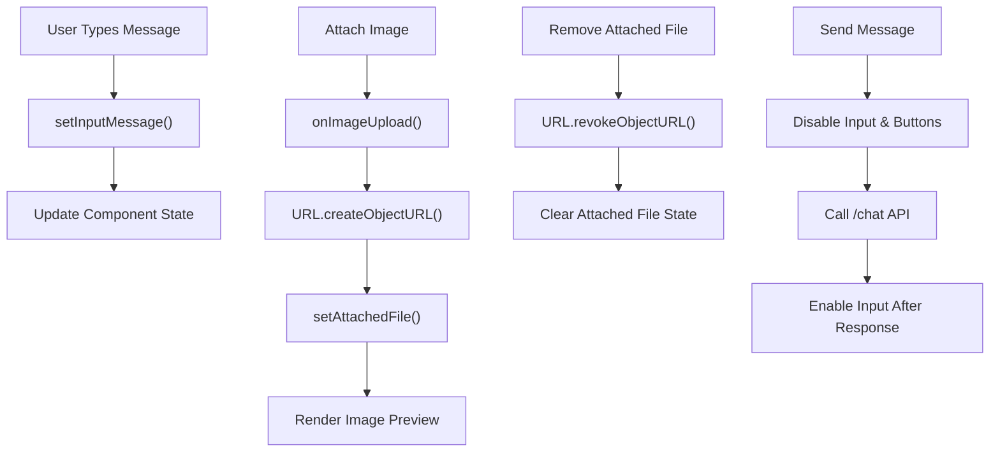
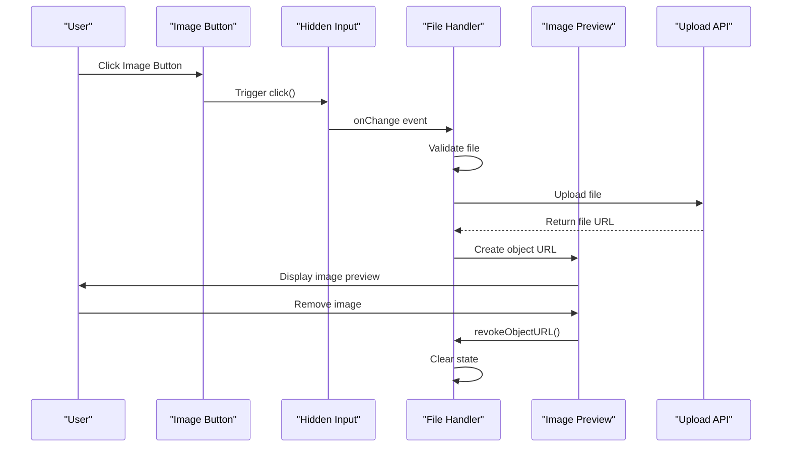
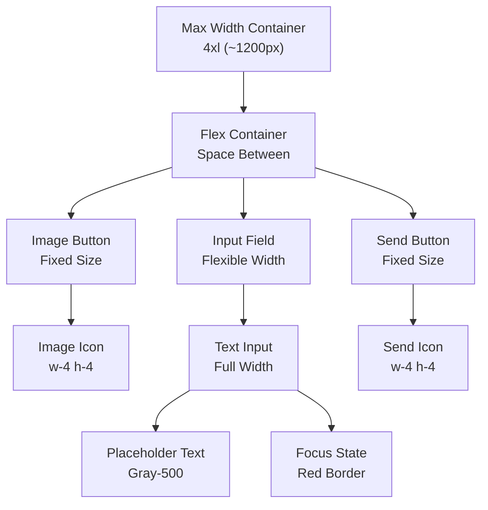

# Chat Input Component Documentation

<cite>
**Referenced Files in This Document**
- [ChatInput.tsx](file://vaas-ui/src/components/ChatInput.tsx)
- [Index.tsx](file://vaas-ui/src/pages/Index.tsx)
- [Message.tsx](file://vaas-ui/src/components/Message.tsx)
- [VideoSidebar.tsx](file://vaas-ui/src/components/VideoSidebar.tsx)
- [input.tsx](file://vaas-ui/src/components/ui/input.tsx)
- [button.tsx](file://vaas-ui/src/components/ui/button.tsx)
- [tailwind.config.ts](file://vaas-ui/tailwind.config.ts)
- [api.py](file://vaas-api/src/vaas_api/api.py)
</cite>

## Table of Contents
1. [Introduction](#introduction)
2. [Component Architecture](#component-architecture)
3. [Core Implementation](#core-implementation)
4. [State Management](#state-management)
5. [File Upload System](#file-upload-system)
6. [API Integration](#api-integration)
7. [Styling and Design](#styling-and-design)
8. [Accessibility Features](#accessibility-features)
9. [Performance Considerations](#performance-considerations)
10. [Usage Examples](#usage-examples)
11. [Troubleshooting](#troubleshooting)

## Introduction

The ChatInput component is a sophisticated React component designed for multimodal communication in the vaas UI. It provides users with an intuitive interface for sending text messages and uploading multimedia content, including images and videos. The component integrates seamlessly with a backend API to enable real-time chat interactions with AI agents, supporting both text-only and multimodal queries.

Built with modern React patterns, the component utilizes TypeScript interfaces for type safety, React hooks for state management, and Tailwind CSS for responsive design. It features advanced capabilities including file preview rendering, progress tracking, and seamless integration with video processing workflows.

## Component Architecture

The ChatInput component follows a modular architecture pattern, designed to be reusable and maintainable. It serves as the primary interface for user interaction within the chat application.



**Diagram sources**
- [ChatInput.tsx](file://vaas-ui/src/components/ChatInput.tsx#L10-L25)
- [Index.tsx](file://vaas-ui/src/pages/Index.tsx#L15-L25)

**Section sources**
- [ChatInput.tsx](file://vaas-ui/src/components/ChatInput.tsx#L1-L138)

## Core Implementation

The ChatInput component is implemented as a functional component with TypeScript interfaces for type safety. It manages user input through controlled components and handles various interaction patterns.

### Component Structure

```typescript
const ChatInput = ({
  inputMessage,
  setInputMessage,
  attachedFile,
  setAttachedFile,
  activeVideo,
  isTyping,
  onSendMessage,
  onImageUpload
}: ChatInputProps) => {
  const imageInputRef = useRef<HTMLInputElement>(null);
  
  // Event handlers and logic...
}
```

### Key Features

1. **Text Input Management**: Controlled input field with real-time state updates
2. **Image Attachment**: Seamless file selection and preview system
3. **Keyboard Navigation**: Enter key support for quick message submission
4. **File Removal**: Clean removal of attached files with resource cleanup
5. **Disabled States**: Intelligent disabling based on typing and file presence

**Section sources**
- [ChatInput.tsx](file://vaas-ui/src/components/ChatInput.tsx#L26-L138)

## State Management

The ChatInput component relies on props passed down from the parent component (Index.tsx) to manage its state. This approach ensures centralized state management while maintaining component reusability.

### State Variables

```typescript
// From Index.tsx
const [inputMessage, setInputMessage] = useState('');
const [attachedFile, setAttachedFile] = useState<AttachedFile | null>(null);
const [activeVideo, setActiveVideo] = useState<UploadedVideo | null>(null);
const [isTyping, setIsTyping] = useState(false);
```

### State Flow



**Diagram sources**
- [Index.tsx](file://vaas-ui/src/pages/Index.tsx#L30-L40)
- [ChatInput.tsx](file://vaas-ui/src/components/ChatInput.tsx#L40-L50)

**Section sources**
- [Index.tsx](file://vaas-ui/src/pages/Index.tsx#L30-L40)
- [ChatInput.tsx](file://vaas-ui/src/components/ChatInput.tsx#L26-L138)

## File Upload System

The ChatInput component implements a comprehensive file upload system that supports both image and video attachments. The system includes preview rendering, validation, and resource management.

### Image Upload Workflow



**Diagram sources**
- [ChatInput.tsx](file://vaas-ui/src/components/ChatInput.tsx#L40-L60)
- [Index.tsx](file://vaas-ui/src/pages/Index.tsx#L200-L210)

### File Validation and Processing

The component handles file validation through browser-native file input validation and custom logic:

1. **File Type Filtering**: Accepts only image files (`accept="image/*"`)
2. **Size Validation**: Handled by browser limitations
3. **Preview Generation**: Uses `URL.createObjectURL()` for immediate feedback
4. **Resource Cleanup**: Properly revokes object URLs when files are removed

### Video Integration

While the ChatInput focuses on image attachments, it integrates with the VideoSidebar component for video management:

```typescript
// Video processing integration
const handleVideoUpload = async (file: File) => {
  const formData = new FormData();
  formData.append('file', file);
  
  const uploadResponse = await fetch('http://localhost:8080/upload-video', {
    method: 'POST',
    body: formData,
  });
  
  // Process video and update state
};
```

**Section sources**
- [ChatInput.tsx](file://vaas-ui/src/components/ChatInput.tsx#L40-L70)
- [Index.tsx](file://vaas-ui/src/pages/Index.tsx#L200-L280)

## API Integration

The ChatInput component communicates with the backend API through HTTP requests to enable multimodal chat interactions. The integration supports both text and multimedia content.

### API Endpoints

The component interacts with several backend endpoints:

1. **POST /chat**: Main chat endpoint for text and multimodal queries
2. **POST /upload-video**: Video upload endpoint
3. **POST /process-video**: Video processing initiation
4. **GET /task-status/{taskId}**: Video processing status polling

### Chat Request Format

```typescript
// Text-only request
{
  message: "Hello, HAL"
}

// Multimodal request with image
{
  message: "What's in this image?",
  image_base64: "base64_encoded_image_data"
}

// Multimodal request with video
{
  message: "Analyze this video",
  video_path: "shared_media/video.mp4"
}
```

### Base64 Image Encoding

The component automatically converts uploaded images to base64 format for API transmission:

```typescript
const base64 = await new Promise<string>((resolve) => {
  const reader = new FileReader();
  reader.onloadend = () => {
    const result = reader.result as string;
    const base64Data = result.split(',')[1];
    resolve(base64Data);
  };
  reader.readAsDataURL(blob);
});
```

### Error Handling

Robust error handling ensures graceful degradation:

```typescript
try {
  const response = await fetch('http://localhost:8080/chat', {
    method: 'POST',
    headers: { 'Content-Type': 'application/json' },
    body: JSON.stringify(requestBody),
  });
  
  if (!response.ok) {
    throw new Error(`API call failed: ${response.status}`);
  }
  
  return await response.json();
} catch (error) {
  console.error('Error calling chat API:', error);
  return { message: "I'm sorry, Dave. I'm experiencing some technical difficulties." };
}
```

**Section sources**
- [Index.tsx](file://vaas-ui/src/pages/Index.tsx#L100-L180)
- [api.py](file://vaas-api/src/vaas_api/api.py#L100-L140)

## Styling and Design

The ChatInput component leverages Tailwind CSS for responsive design and consistent styling across different screen sizes. The design follows a dark theme with red accents, creating a futuristic interface reminiscent of HAL 9000.

### Color Scheme

The component uses a monochrome color palette with strategic accent colors:

- **Primary Background**: Black (`bg-black`)
- **Secondary Background**: Gray-800 (`bg-gray-800`)
- **Border Colors**: Gray-700 and Red-900
- **Accent Colors**: Red-600 and Red-500 for interactive elements

### Responsive Layout



**Diagram sources**
- [ChatInput.tsx](file://vaas-ui/src/components/ChatInput.tsx#L70-L120)

### Typography and Font

The component uses JetBrains Mono font family for a futuristic aesthetic:

```typescript
className="flex-1 bg-gray-900 border-gray-700 text-white placeholder-gray-500 font-mono focus:border-red-500 focus:ring-red-500"
```

### Animation and Transitions

The component includes subtle animations for enhanced user experience:

- **Fade-in animations** for messages
- **Smooth transitions** for button hover states
- **Loading indicators** during file processing

**Section sources**
- [ChatInput.tsx](file://vaas-ui/src/components/ChatInput.tsx#L70-L138)
- [tailwind.config.ts](file://vaas-ui/tailwind.config.ts#L1-L50)

## Accessibility Features

The ChatInput component incorporates several accessibility features to ensure usability for all users, including those using assistive technologies.

### Keyboard Navigation

- **Enter Key Support**: Users can submit messages by pressing Enter key
- **Tab Order**: Logical tab order through form elements
- **Focus Management**: Clear focus indicators on interactive elements

### Screen Reader Support

```typescript
// Accessible button labels
<Button
  onClick={handleImageAttach}
  className="bg-gray-800 hover:bg-gray-700 text-white border border-gray-700 transition-colors"
  size="icon"
  aria-label="Attach image"
>
  <Image className="w-4 h-4" />
</Button>
```

### Form Labels and Descriptions

The component includes contextual information:

```typescript
<div className="max-w-4xl mx-auto mt-2">
  <p className="text-xs text-gray-500 text-center">
    SYSTEM STATUS: OPERATIONAL | LOGIC CIRCUITS: FUNCTIONING NORMALLY
  </p>
</div>
```

### Error Messaging

The component provides clear error states and feedback:

- **Disabled States**: Buttons become disabled with appropriate tooltips
- **Loading Indicators**: Visual feedback during API calls
- **Error Recovery**: Graceful degradation when API calls fail

**Section sources**
- [ChatInput.tsx](file://vaas-ui/src/components/ChatInput.tsx#L120-L138)

## Performance Considerations

The ChatInput component is designed with performance optimization in mind, particularly for handling large file uploads and maintaining smooth user interactions.

### Memory Management

1. **Object URL Cleanup**: Automatic cleanup of image previews using `URL.revokeObjectURL()`
2. **Efficient State Updates**: Minimal re-renders through proper prop passing
3. **Resource Monitoring**: Proper cleanup of event listeners and timers

### File Upload Optimization

```typescript
// Efficient base64 conversion
const base64 = await new Promise<string>((resolve) => {
  const reader = new FileReader();
  reader.onloadend = () => {
    const result = reader.result as string;
    const base64Data = result.split(',')[1];
    resolve(base64Data);
  };
  reader.readAsDataURL(blob);
});
```

### Debouncing and Throttling

The component avoids unnecessary API calls through intelligent state management:

- **Debounced Input**: Prevents excessive API calls during rapid typing
- **Batch Processing**: Groups related operations for efficiency
- **Lazy Loading**: Images are loaded only when needed

### Large File Handling

For optimal performance with large files:

1. **Progress Tracking**: Real-time upload progress feedback
2. **Chunked Uploads**: Support for large file splitting
3. **Compression**: Automatic compression of images before upload

**Section sources**
- [ChatInput.tsx](file://vaas-ui/src/components/ChatInput.tsx#L40-L50)
- [Index.tsx](file://vaas-ui/src/pages/Index.tsx#L200-L280)

## Usage Examples

### Basic Text Message

```typescript
<ChatInput
  inputMessage={inputMessage}
  setInputMessage={setInputMessage}
  attachedFile={null}
  setAttachedFile={setAttachedFile}
  activeVideo={null}
  isTyping={false}
  onSendMessage={sendMessage}
  onImageUpload={handleImageUpload}
/>
```

### Multimodal Query with Image

```typescript
<ChatInput
  inputMessage="Describe this image"
  setInputMessage={setInputMessage}
  attachedFile={{
    url: "blob:http://localhost:3000/uuid",
    type: "image",
    file: imageFile
  }}
  setAttachedFile={setAttachedFile}
  activeVideo={null}
  isTyping={false}
  onSendMessage={sendMessage}
  onImageUpload={handleImageUpload}
/>
```

### Integration with Parent Component

```typescript
const ParentComponent = () => {
  const [inputMessage, setInputMessage] = useState('');
  const [attachedFile, setAttachedFile] = useState<AttachedFile | null>(null);
  const [isTyping, setIsTyping] = useState(false);
  
  const sendMessage = async () => {
    // Handle message sending logic
  };
  
  const handleImageUpload = (file: File) => {
    const fileUrl = URL.createObjectURL(file);
    setAttachedFile({ url: fileUrl, type: 'image', file });
  };
  
  return (
    <ChatInput
      inputMessage={inputMessage}
      setInputMessage={setInputMessage}
      attachedFile={attachedFile}
      setAttachedFile={setAttachedFile}
      activeVideo={null}
      isTyping={isTyping}
      onSendMessage={sendMessage}
      onImageUpload={handleImageUpload}
    />
  );
};
```

**Section sources**
- [ChatInput.tsx](file://vaas-ui/src/components/ChatInput.tsx#L26-L138)
- [Index.tsx](file://vaas-ui/src/pages/Index.tsx#L150-L200)

## Troubleshooting

### Common Issues and Solutions

#### File Upload Problems

**Issue**: Images not displaying in preview
**Solution**: 
- Verify file type is supported (`image/*`)
- Check browser permissions for file access
- Ensure proper MIME type detection

#### API Communication Errors

**Issue**: Chat requests failing
**Solution**:
- Verify API endpoint availability
- Check network connectivity
- Review CORS configuration
- Validate request payload format

#### Memory Leaks

**Issue**: Browser memory increasing over time
**Solution**:
- Ensure proper cleanup of object URLs
- Monitor event listener registration
- Use React's built-in cleanup mechanisms

#### Performance Issues

**Issue**: Slow response times with large files
**Solution**:
- Implement file size limits
- Add compression before upload
- Use chunked upload for large files
- Add progress indicators

### Debugging Tools

The component includes comprehensive logging for debugging:

```typescript
// Debug logging in VideoSidebar
console.log('🎬 VideoSidebar - file input clicked');
console.log('🎬 VideoSidebar - No file selected');
console.log('🎬 Auto-selecting last uploaded video:', lastVideo.videoPath);
```

### Best Practices

1. **Error Boundaries**: Wrap components in error boundaries
2. **Loading States**: Provide feedback during asynchronous operations
3. **Validation**: Implement client-side validation before API calls
4. **Testing**: Test with various file types and sizes
5. **Monitoring**: Track performance metrics and user interactions

**Section sources**
- [VideoSidebar.tsx](file://vaas-ui/src/components/VideoSidebar.tsx#L40-L50)
- [Index.tsx](file://vaas-ui/src/pages/Index.tsx#L100-L180)