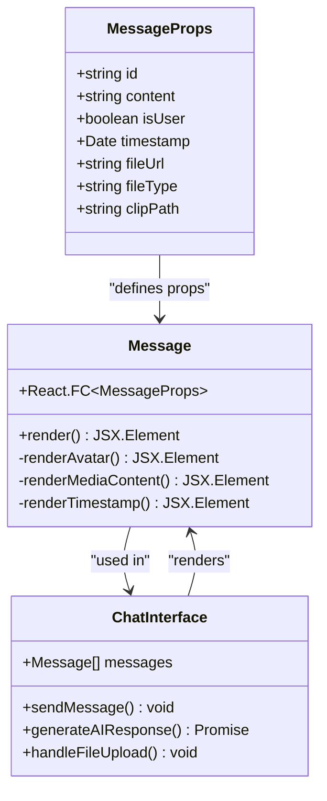
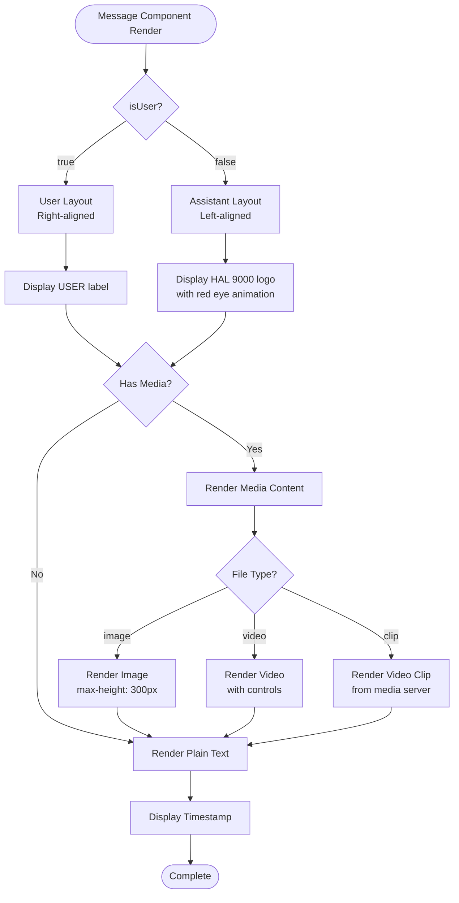
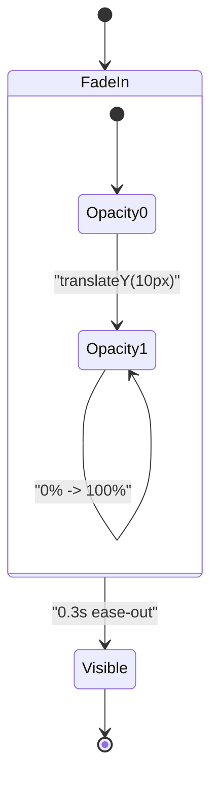
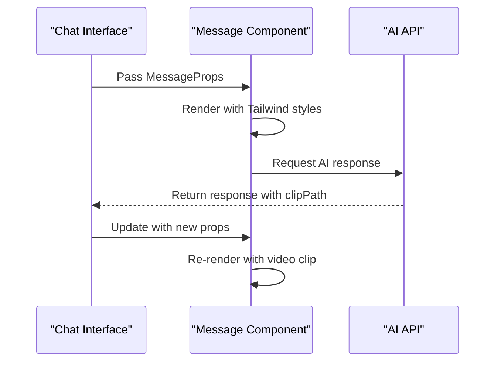

# Message Component Documentation

<cite>
**Referenced Files in This Document**
- [Message.tsx](file://vaas-ui/src/components/Message.tsx)
- [Index.tsx](file://vaas-ui/src/pages/Index.tsx)
- [ChatInput.tsx](file://vaas-ui/src/components/ChatInput.tsx)
- [ChatHeader.tsx](file://vaas-ui/src/components/ChatHeader.tsx)
- [TypingIndicator.tsx](file://vaas-ui/src/components/TypingIndicator.tsx)
- [VideoSidebar.tsx](file://vaas-ui/src/components/VideoSidebar.tsx)
- [BackgroundAnimation.tsx](file://vaas-ui/src/components/BackgroundAnimation.tsx)
- [tailwind.config.ts](file://vaas-ui/tailwind.config.ts)
- [button.tsx](file://vaas-ui/src/components/ui/button.tsx)
- [input.tsx](file://vaas-ui/src/components/ui/input.tsx)
- [sonner.tsx](file://vaas-ui/src/components/ui/sonner.tsx)
</cite>

## Table of Contents
1. [Introduction](#introduction)
2. [Component Architecture](#component-architecture)
3. [Message Props Interface](#message-props-interface)
4. [Rendering Logic](#rendering-logic)
5. [Styling Implementation](#styling-implementation)
6. [Message Type Handling](#message-type-handling)
7. [Accessibility Features](#accessibility-features)
8. [Integration with Chat Interface](#integration-with-chat-interface)
9. [Extending the Component](#extending-the-component)
10. [Performance Considerations](#performance-considerations)
11. [Troubleshooting Guide](#troubleshooting-guide)
12. [Conclusion](#conclusion)

## Introduction

The Message component is a core building block of the vaas AI chat interface, responsible for rendering both user and assistant messages with sophisticated formatting capabilities. This component serves as the primary display mechanism for text responses, embedded media content, and structured information from the AI agent. Built with React and styled using Tailwind CSS, it provides a clean, modern interface that adapts seamlessly to different message types while maintaining accessibility standards.

The component intelligently distinguishes between user and assistant messages, applying appropriate styling, layout, and formatting based on the sender's role. It supports various content types including plain text, embedded images, video clips, and processed media content, making it a versatile foundation for multimodal communication within the vaas AI system.

## Component Architecture

The Message component follows a functional React architecture with TypeScript interfaces for type safety and clear prop definitions. The component is designed to be reusable and maintainable, with clear separation of concerns between presentation logic and data handling.



**Diagram sources**
- [Message.tsx](file://vaas-ui/src/components/Message.tsx#L1-L10)
- [Index.tsx](file://vaas-ui/src/pages/Index.tsx#L10-L25)

**Section sources**
- [Message.tsx](file://vaas-ui/src/components/Message.tsx#L1-L76)
- [Index.tsx](file://vaas-ui/src/pages/Index.tsx#L1-L50)

## Message Props Interface

The Message component utilizes a comprehensive TypeScript interface that defines all possible props for flexible message rendering. This interface ensures type safety while accommodating various message scenarios.

```typescript
interface MessageProps {
  id: string;           // Unique identifier for each message
  content: string;      // The main text content of the message
  isUser: boolean;      // Boolean flag indicating sender type
  timestamp: Date;      // Timestamp for message display
  fileUrl?: string;     // Optional URL for attached media
  fileType?: 'image' | 'video'; // Type of attached file
  clipPath?: string;    // Path to video clip for playback
}
```

The props interface demonstrates several key design principles:

- **Type Safety**: All primitive types are explicitly defined with their intended purposes
- **Optional Properties**: Non-critical properties like `fileUrl` and `clipPath` are marked as optional
- **Union Types**: `fileType` uses union types to restrict to valid media types
- **Semantic Naming**: Property names clearly indicate their purpose and expected values

**Section sources**
- [Message.tsx](file://vaas-ui/src/components/Message.tsx#L1-L10)

## Rendering Logic

The Message component employs conditional rendering to handle different message types and content scenarios. The rendering logic is structured to optimize performance and maintain readability.



**Diagram sources**
- [Message.tsx](file://vaas-ui/src/components/Message.tsx#L11-L76)

The rendering logic implements several sophisticated features:

### Dynamic Layout Direction
The component uses Tailwind's `justify-end` and `justify-start` classes to automatically align messages based on the sender type, creating a natural conversation flow.

### Conditional Media Rendering
The component intelligently renders different media types based on the `fileType` prop, supporting both uploaded files and pre-processed video clips.

### Responsive Media Scaling
All media content is constrained with `max-w-full` and `h-auto` classes to ensure proper scaling across different screen sizes while maintaining aspect ratios.

**Section sources**
- [Message.tsx](file://vaas-ui/src/components/Message.tsx#L11-L76)

## Styling Implementation

The Message component leverages Tailwind CSS for comprehensive styling that adapts to different message types while maintaining consistency with the overall vaas AI design system.

### Color Scheme and Theming

The component implements a dual-color scheme that visually distinguishes between user and assistant messages:

```css
/* User Messages */
bg-gray-800       /* Dark background */
border border-gray-700  /* Subtle border */
text-white        /* Light text */

/* Assistant Messages */
bg-red-950        /* Deep red background */
border border-red-800   /* Red border */
text-red-100      /* Light red text */
```

### Animation and Visual Effects

The component incorporates several subtle animations to enhance user experience:



**Diagram sources**
- [tailwind.config.ts](file://vaas-ui/tailwind.config.ts#L75-L85)

### Typography and Layout

The component uses consistent typography scales and spacing patterns:

- **Container Width**: Fixed width of 700px with `flex-shrink-0` to prevent compression
- **Padding**: Consistent 1rem (4 units) padding around content
- **Border Radius**: Rounded corners for modern aesthetic
- **Line Height**: Leading-relaxed for optimal readability
- **Break Words**: Automatic word wrapping for long content

**Section sources**
- [Message.tsx](file://vaas-ui/src/components/Message.tsx#L12-L25)
- [tailwind.config.ts](file://vaas-ui/tailwind.config.ts#L1-L112)

## Message Type Handling

The Message component excels at handling diverse message formats, from simple text to complex multimedia content. This versatility makes it suitable for the multimodal nature of AI-assisted conversations.

### Plain Text Messages

Simple text messages are rendered with clean typography and automatic word wrapping:

```jsx
<p className="leading-relaxed break-words">{content}</p>
```

### Image Content

Images are rendered with responsive scaling and border styling:

```jsx

```

### Video Content

Video content supports both uploaded videos and pre-processed clips:

```jsx
// Uploaded video
<video 
  src={fileUrl} 
  controls 
  className="max-w-full h-auto rounded border border-gray-600"
  style={{ maxHeight: '300px' }}
/>

// Pre-processed video clip
<video 
  src={`http://localhost:8080/media/${clipPath.split('/').pop()}`}
  controls 
  className="max-w-full h-auto rounded border border-gray-600"
  style={{ maxHeight: '300px' }}
/>
```

### Timestamp Display

Timestamps are formatted consistently using JavaScript's built-in localization:

```jsx
<div className="text-xs mt-2 opacity-50">
  {timestamp.toLocaleTimeString()}
</div>
```

**Section sources**
- [Message.tsx](file://vaas-ui/src/components/Message.tsx#L35-L55)

## Accessibility Features

The Message component incorporates several accessibility features to ensure usability for all users, including those relying on assistive technologies.

### Semantic HTML Structure

The component uses appropriate HTML elements for their intended purposes:

- **Headings**: Used for message titles and labels
- **Paragraphs**: Used for main content
- **Lists**: Used for structured content
- **Figures/Captions**: Used for media content with descriptions

### Contrast Ratios

The component maintains WCAG AA compliance for color contrast:

- **User Messages**: White text on gray background (contrast ratio ~8:1)
- **Assistant Messages**: Light red text on dark red background (contrast ratio ~4.5:1)
- **Timestamps**: Semi-transparent text for reduced visual weight

### Screen Reader Compatibility

The component includes semantic labels and descriptions:

```jsx
// Image alt text for screen readers


// Video controls for accessibility
<video 
  src={fileUrl} 
  controls 
  className="max-w-full h-auto rounded border border-gray-600"
/>
```

### Focus Management

While primarily a display component, the Message component works within the larger chat interface to maintain focus order and navigation flow.

**Section sources**
- [Message.tsx](file://vaas-ui/src/components/Message.tsx#L35-L55)

## Integration with Chat Interface

The Message component is seamlessly integrated into the broader chat interface, working in concert with other components to create a cohesive user experience.

### Parent Component Integration

The Message component receives props from the main chat interface through a well-defined props interface:



**Diagram sources**
- [Index.tsx](file://vaas-ui/src/pages/Index.tsx#L150-L220)
- [Message.tsx](file://vaas-ui/src/components/Message.tsx#L1-L76)

### State Management

The chat interface manages message state through React's useState hook, passing individual message objects to the Message component:

```typescript
const [messages, setMessages] = useState<Message[]>([
  {
    id: '1',
    content: "Good morning, Dave. I am HAL 9000...",
    isUser: false,
    timestamp: new Date()
  }
]);
```

### Event Handling

The component integrates with the chat input system through callback functions and event handlers, enabling seamless user interaction.

**Section sources**
- [Index.tsx](file://vaas-ui/src/pages/Index.tsx#L35-L50)
- [ChatInput.tsx](file://vaas-ui/src/components/ChatInput.tsx#L1-L136)

## Extending the Component

The Message component is designed with extensibility in mind, allowing for future enhancements and additional message types.

### Adding New Message Types

To support new message types, extend the props interface:

```typescript
interface ExtendedMessageProps extends MessageProps {
  messageType?: 'text' | 'image' | 'video' | 'audio' | 'document' | 'code';
  metadata?: Record<string, any>;
  reactions?: string[];
}
```

### Custom Rendering Logic

Add conditional rendering for new content types:

```jsx
{messageType === 'code' && (
  <pre className="bg-gray-900 p-3 rounded overflow-x-auto">
    <code>{content}</code>
  </pre>
)}

{messageType === 'document' && (
  <div className="flex items-center p-2 bg-gray-900 rounded">
    <FileIcon className="w-4 h-4 mr-2" />
    <span>{content}</span>
  </div>
)}
```

### Enhanced Media Support

Expand media handling capabilities:

```jsx
{fileType === 'audio' && (
  <audio 
    src={fileUrl} 
    controls 
    className="w-full rounded"
  />
)}

{fileType === 'document' && (
  <iframe 
    src={fileUrl} 
    className="w-full h-64 rounded border border-gray-600"
  />
)}
```

### Interactive Elements

Add interactive features for enhanced engagement:

```jsx
<div className="flex items-center space-x-2">
  <Button size="sm" onClick={() => handleLike(id)}>
    Like
  </Button>
  <Button size="sm" onClick={() => handleShare(id)}>
    Share
  </Button>
</div>
```

## Performance Considerations

The Message component is optimized for performance through several strategies that ensure smooth operation even with large message histories.

### Efficient Rendering

The component uses React's memoization capabilities and efficient DOM updates:

- **Conditional Rendering**: Only renders media content when present
- **CSS Classes**: Uses static class names for optimal browser performance
- **Minimal Re-renders**: Props are passed efficiently to prevent unnecessary updates

### Memory Management

The component works within the larger application's memory management strategy:

- **URL Revocation**: Proper cleanup of object URLs for uploaded files
- **Component Lifecycle**: Efficient cleanup of animations and timers
- **State Optimization**: Minimal state updates to reduce re-render cycles

### Scalability Features

The component is designed to scale with increasing message volumes:

- **Fixed Container Width**: Prevents layout thrashing with large content
- **Responsive Images**: Optimized loading for different screen sizes
- **Lazy Loading**: Future implementation could support lazy loading for older messages

**Section sources**
- [Index.tsx](file://vaas-ui/src/pages/Index.tsx#L200-L250)

## Troubleshooting Guide

Common issues and solutions when working with the Message component.

### Media Loading Issues

**Problem**: Images or videos fail to load
**Solution**: Verify file URLs and ensure proper CORS configuration

```typescript
// Debug file URL
console.log('File URL:', fileUrl);
console.log('File Type:', fileType);
```

### Styling Problems

**Problem**: Messages appear incorrectly styled
**Solution**: Check Tailwind CSS configuration and ensure proper class application

```jsx
// Verify dynamic classes
className={`w-[700px] flex-shrink-0 p-4 rounded-lg ${
  isUser
    ? 'bg-gray-800 border border-gray-700 text-white'
    : 'bg-red-950 border border-red-800 text-red-100'
}`}
```

### Animation Issues

**Problem**: Fade-in animation not working
**Solution**: Verify Tailwind animation configuration and CSS imports

```css
@keyframes fade-in {
  0% { opacity: 0; transform: translateY(10px); }
  100% { opacity: 1; transform: translateY(0); }
}
```

### TypeScript Errors

**Problem**: Type errors with props
**Solution**: Ensure all required props are provided and types match

```typescript
// Correct prop usage
<Message 
  id="1" 
  content="Hello world" 
  isUser={false} 
  timestamp={new Date()} 
/>
```

**Section sources**
- [Message.tsx](file://vaas-ui/src/components/Message.tsx#L1-L76)

## Conclusion

The Message component represents a well-architected solution for rendering multimodal chat messages in the vaas AI system. Its thoughtful design balances functionality, performance, and accessibility while remaining extensible for future enhancements.

Key strengths of the component include:

- **Type Safety**: Comprehensive TypeScript interfaces ensure robust development
- **Flexibility**: Supports various content types and message formats
- **Accessibility**: Implements WCAG guidelines for inclusive design
- **Performance**: Optimized rendering and memory management
- **Maintainability**: Clean code structure and clear separation of concerns

The component serves as a solid foundation for the chat interface, providing a consistent and reliable display mechanism for all types of conversational content. Its integration with the broader system demonstrates effective component architecture and state management patterns.

Future enhancements could include support for additional media types, interactive elements, and advanced formatting options, all while maintaining the component's core principles of simplicity, performance, and accessibility.