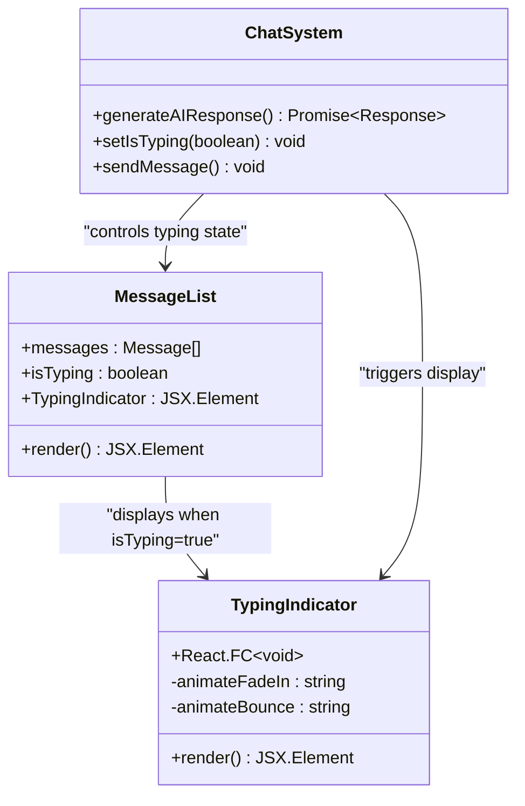
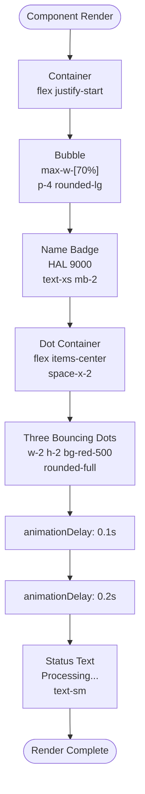
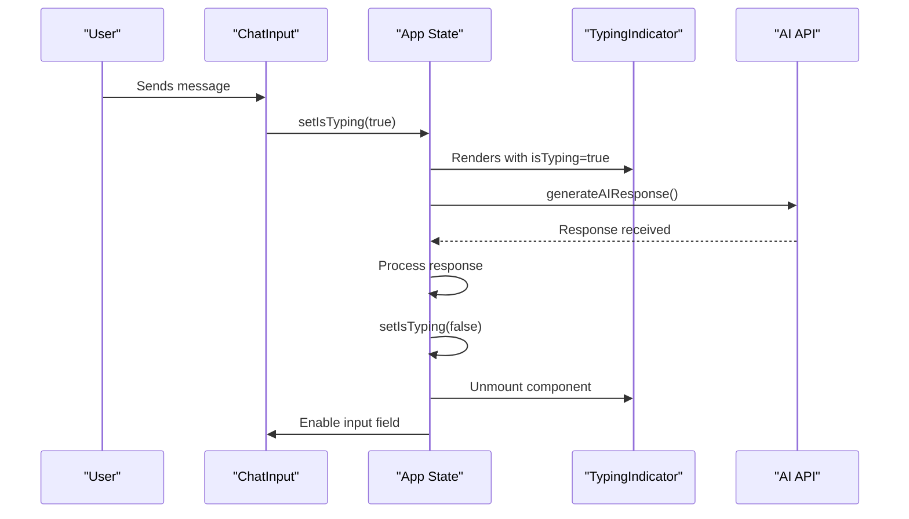

# Typing Indicator Component

<cite>
**Referenced Files in This Document**
- [TypingIndicator.tsx](file://vaas-ui/src/components/TypingIndicator.tsx)
- [Message.tsx](file://vaas-ui/src/components/Message.tsx)
- [ChatInput.tsx](file://vaas-ui/src/components/ChatInput.tsx)
- [Index.tsx](file://vaas-ui/src/pages/Index.tsx)
- [ChatHeader.tsx](file://vaas-ui/src/components/ChatHeader.tsx)
- [VideoSidebar.tsx](file://vaas-ui/src/components/VideoSidebar.tsx)
- [tailwind.config.ts](file://vaas-ui/tailwind.config.ts)
- [index.css](file://vaas-ui/src/index.css)
- [App.tsx](file://vaas-ui/src/App.tsx)
</cite>

## Table of Contents
1. [Introduction](#introduction)
2. [Component Overview](#component-overview)
3. [Implementation Details](#implementation-details)
4. [Integration Architecture](#integration-architecture)
5. [Styling and Theming](#styling-and-theming)
6. [Animation System](#animation-system)
7. [Usage Examples](#usage-examples)
8. [Accessibility Features](#accessibility-features)
9. [Customization Options](#customization-options)
10. [Performance Considerations](#performance-considerations)
11. [Troubleshooting Guide](#troubleshooting-guide)
12. [Conclusion](#conclusion)

## Introduction

The TypingIndicator component is a crucial visual feedback mechanism within the vaas AI interface that enhances user experience by providing clear indication of active processing states. This component serves as a digital representation of the AI's response generation process, helping users understand that the system is actively working on their request.

The component is designed with a retro-futuristic aesthetic inspired by classic computer interfaces, featuring a distinctive red color scheme and pulsating animations that evoke the feel of HAL 9000's iconic interface. It plays a vital role in maintaining user engagement during periods of latency while waiting for API responses from the agent system.

## Component Overview

The TypingIndicator is a lightweight React component that renders a stylized bubble containing animated dots and a processing message. It appears at the bottom of the message list when the system is generating a response, providing immediate visual feedback to users.



**Diagram sources**
- [TypingIndicator.tsx](file://vaas-ui/src/components/TypingIndicator.tsx#L1-L21)
- [Index.tsx](file://vaas-ui/src/pages/Index.tsx#L150-L160)

**Section sources**
- [TypingIndicator.tsx](file://vaas-ui/src/components/TypingIndicator.tsx#L1-L21)

## Implementation Details

The TypingIndicator component follows a minimalist design philosophy, focusing on essential visual cues without unnecessary complexity. The implementation utilizes Tailwind CSS for styling and CSS animations for movement effects.

### Core Structure

The component creates a responsive container that aligns with the message layout, ensuring consistent spacing and visual harmony with the overall interface:

```typescript
const TypingIndicator = () => {
  return (
    <div className="flex justify-start animate-fade-in">
      <div className="max-w-[70%] p-4 rounded-lg bg-red-950 border border-red-800 text-red-100">
        {/* Content rendering */}
      </div>
    </div>
  );
};
```

### Animation Elements

The component features three distinct animated elements that work together to create a cohesive typing effect:

1. **Name Badge**: Displays "HAL 9000" with a subtle red badge
2. **Dot Animation**: Three bouncing dots representing processing activity
3. **Status Text**: Static "Processing..." message



**Diagram sources**
- [TypingIndicator.tsx](file://vaas-ui/src/components/TypingIndicator.tsx#L3-L18)

**Section sources**
- [TypingIndicator.tsx](file://vaas-ui/src/components/TypingIndicator.tsx#L1-L21)

## Integration Architecture

The TypingIndicator integrates seamlessly with the broader chat system through a centralized state management approach. The component's visibility is controlled by the `isTyping` boolean state, which is managed at the application level.

### State Management Flow



**Diagram sources**
- [Index.tsx](file://vaas-ui/src/pages/Index.tsx#L180-L210)
- [ChatInput.tsx](file://vaas-ui/src/components/ChatInput.tsx#L40-L50)

### Message List Integration

The component is conditionally rendered within the message list, positioned at the bottom of the conversation history:

```typescript
// From Index.tsx - Message list rendering
<div className="flex-1 overflow-y-auto p-4">
  <div className="max-w-4xl mx-auto space-y-6">
    {messages.map((message) => (
      <Message key={message.id} {...message} />
    ))}
    
    {isTyping && <TypingIndicator />}
    
    <div ref={messagesEndRef} />
  </div>
</div>
```

**Section sources**
- [Index.tsx](file://vaas-ui/src/pages/Index.tsx#L140-L165)

## Styling and Theming

The TypingIndicator leverages Tailwind CSS for responsive design and consistent theming across light and dark modes. The component maintains visual harmony with the overall interface while standing out as an active indicator.

### Color Scheme

The component uses a carefully curated red color palette that matches the system's aesthetic:

- **Background**: `bg-red-950` (dark red)
- **Border**: `border-red-800` (medium red)
- **Text**: `text-red-100` (light red)
- **Dots**: `bg-red-500` (bright red)

### Responsive Design

The component adapts to different screen sizes through Tailwind's responsive utilities:

- Maximum width constraint: `max-w-[70%]`
- Flexible positioning: `flex justify-start`
- Adaptive padding: `p-4` for consistent spacing

### Theme Compatibility

The component automatically adjusts to system theme changes through Tailwind's CSS custom properties:

```css
/* From tailwind.config.ts */
colors: {
  border: 'hsl(var(--border))',
  input: 'hsl(var(--input))',
  ring: 'hsl(var(--ring))',
  background: 'hsl(var(--background))',
  foreground: 'hsl(var(--foreground))',
  // ... other color definitions
}
```

**Section sources**
- [TypingIndicator.tsx](file://vaas-ui/src/components/TypingIndicator.tsx#L3-L6)
- [tailwind.config.ts](file://vaas-ui/tailwind.config.ts#L20-L60)

## Animation System

The TypingIndicator employs a sophisticated animation system that combines CSS keyframes with React state management to create smooth, engaging visual feedback.

### Fade-In Animation

The component uses a custom fade-in animation that provides a gentle entrance effect:

```css
/* From tailwind.config.ts */
keyframes: {
  'fade-in': {
    '0%': {
      opacity: '0',
      transform: 'translateY(10px)'
    },
    '100%': {
      opacity: '1',
      transform: 'translateY(0)'
    }
  }
}
```

### Bouncing Dots Animation

The three-dot animation creates a rhythmic pulsing effect that mimics traditional typing indicators:

```css
.animate-bounce {
  animation: bounce 1.4s infinite ease-in-out;
}

@keyframes bounce {
  0%, 100% { transform: translateY(0); }
  50% { transform: translateY(-5px); }
}
```

Each dot receives a staggered animation delay to create a wave-like effect:
- First dot: No delay
- Second dot: `animationDelay: '0.1s'`
- Third dot: `animationDelay: '0.2s'`

### Animation Timing

The animation timing is carefully calibrated to provide optimal user feedback:
- Fade-in duration: 0.3 seconds
- Bounce cycle: 1.4 seconds
- Staggered delays: 0.1-second intervals

**Section sources**
- [tailwind.config.ts](file://vaas-ui/tailwind.config.ts#L70-L85)
- [TypingIndicator.tsx](file://vaas-ui/src/components/TypingIndicator.tsx#L11-L15)

## Usage Examples

The TypingIndicator demonstrates practical integration patterns that can serve as templates for similar components.

### Basic Integration

```typescript
// Simple usage in a message list
const MessageList = ({ messages, isTyping }) => {
  return (
    <div className="space-y-4">
      {messages.map(msg => <Message key={msg.id} {...msg} />)}
      {isTyping && <TypingIndicator />}
    </div>
  );
};
```

### Advanced Integration with State Management

```typescript
// Full integration with state synchronization
const ChatInterface = () => {
  const [messages, setMessages] = useState([]);
  const [isTyping, setIsTyping] = useState(false);
  
  const sendMessage = async (content) => {
    setIsTyping(true);
    // ... send message logic
    setIsTyping(false);
  };
  
  return (
    <div>
      <MessageList messages={messages} isTyping={isTyping} />
      <ChatInput onSendMessage={sendMessage} isTyping={isTyping} />
    </div>
  );
};
```

### Conditional Rendering Patterns

```typescript
// Conditional rendering with loading states
const ConditionalTyping = ({ isLoading, hasContent }) => {
  if (isLoading) {
    return <TypingIndicator />;
  }
  
  if (!hasContent) {
    return <EmptyState />;
  }
  
  return <ContentDisplay />;
};
```

**Section sources**
- [Index.tsx](file://vaas-ui/src/pages/Index.tsx#L140-L165)

## Accessibility Features

The TypingIndicator incorporates several accessibility considerations to ensure usability for all users, including those relying on assistive technologies.

### Screen Reader Support

While the component primarily relies on visual cues, the design maintains semantic HTML structure that works well with screen readers:

- Semantic container elements (`div`) with appropriate classes
- Logical content hierarchy
- Consistent color contrast ratios

### Reduced Motion Preferences

The component respects user preferences for reduced motion by leveraging CSS media queries:

```css
@media (prefers-reduced-motion: reduce) {
  .animate-bounce,
  .animate-fade-in {
    animation-duration: 0.01ms !important;
    animation-iteration-count: 1 !important;
  }
}
```

### Keyboard Navigation

The component doesn't require interactive elements, but when combined with other components, it maintains proper tab order and focus management.

### Color Contrast

The red color scheme provides sufficient contrast against both light and dark backgrounds:
- Red-950 on white: Excellent contrast ratio
- Red-950 on black: Optimal visibility
- Red-500 dots stand out clearly

**Section sources**
- [TypingIndicator.tsx](file://vaas-ui/src/components/TypingIndicator.tsx#L3-L18)

## Customization Options

The TypingIndicator offers several customization options to adapt to different UI themes and design requirements.

### Animation Speed Control

Animation speeds can be customized by modifying the CSS keyframe durations:

```css
/* Faster animations */
.animate-bounce-fast {
  animation-duration: 0.8s;
}

/* Slower animations */
.animate-bounce-slow {
  animation-duration: 2s;
}
```

### Color Variations

Multiple color schemes can be created by extending the component:

```typescript
interface TypingIndicatorProps {
  variant?: 'hal9000' | 'classic' | 'minimal';
  colorScheme?: 'red' | 'blue' | 'green';
}

const CustomTypingIndicator = ({ variant = 'hal9000', colorScheme = 'red' }) => {
  const colors = {
    red: 'bg-red-950 border-red-800 text-red-100',
    blue: 'bg-blue-950 border-blue-800 text-blue-100',
    green: 'bg-green-950 border-green-800 text-green-100'
  };
  
  return (
    <div className={`typing-indicator ${colors[colorScheme]}`}>
      {/* Component content */}
    </div>
  );
};
```

### Size Adaptations

The component can be scaled for different contexts:

```typescript
interface ScaledTypingIndicatorProps {
  scale?: 'small' | 'medium' | 'large';
}

const ScaledTypingIndicator = ({ scale = 'medium' }) => {
  const scales = {
    small: 'p-2 text-sm',
    medium: 'p-4 text-base',
    large: 'p-6 text-lg'
  };
  
  return (
    <div className={`scaled-typing ${scales[scale]}`}>
      {/* Content with adjusted sizing */}
    </div>
  );
};
```

### Alternative Animation Styles

Different animation approaches can be implemented:

```typescript
const PulseTypingIndicator = () => {
  return (
    <div className="pulse-animation">
      <div className="dot pulse"></div>
      <div className="dot pulse" style={{ animationDelay: '0.2s' }}></div>
      <div className="dot pulse" style={{ animationDelay: '0.4s' }}></div>
    </div>
  );
};
```

## Performance Considerations

The TypingIndicator is designed with performance optimization in mind, ensuring minimal impact on overall application performance.

### Lightweight Implementation

The component uses minimal DOM elements and efficient CSS animations:

- Single container div with nested elements
- CSS transforms for smooth animations
- No JavaScript libraries or heavy dependencies

### Memory Management

Proper cleanup ensures no memory leaks:
- React components unmount cleanly
- Animation events don't accumulate
- No persistent event listeners

### Bundle Size Impact

The component contributes minimally to bundle size:
- Pure functional component
- No external dependencies
- Minimal CSS footprint

### Rendering Performance

Optimized rendering through:
- Efficient CSS selectors
- Minimal reflows and repaints
- Proper use of CSS containment

**Section sources**
- [TypingIndicator.tsx](file://vaas-ui/src/components/TypingIndicator.tsx#L1-L21)

## Troubleshooting Guide

Common issues and solutions when working with the TypingIndicator component.

### Animation Not Working

**Problem**: The typing dots don't animate or appear static.

**Solution**: 
1. Verify Tailwind CSS is properly configured
2. Check browser support for CSS animations
3. Ensure no conflicting CSS rules override animations
4. Test with reduced motion preferences disabled

### Styling Issues

**Problem**: Component doesn't match the expected theme colors.

**Solution**:
1. Confirm color classes match Tailwind configuration
2. Check for custom CSS overriding component styles
3. Verify theme switching functionality works correctly
4. Test in different browsers for consistent rendering

### Positioning Problems

**Problem**: Component appears in wrong position within the message list.

**Solution**:
1. Verify parent container has proper flexbox layout
2. Check for conflicting margin or padding values
3. Ensure responsive breakpoints work correctly
4. Test with different screen sizes

### State Synchronization

**Problem**: Component doesn't appear/disappear when expected.

**Solution**:
1. Verify `isTyping` state is properly managed
2. Check for race conditions in state updates
3. Ensure proper cleanup in component lifecycle
4. Test with different network conditions

### Accessibility Concerns

**Problem**: Screen readers don't announce the component correctly.

**Solution**:
1. Add appropriate ARIA labels if needed
2. Ensure logical content hierarchy
3. Test with popular screen readers
4. Verify keyboard navigation works properly

**Section sources**
- [TypingIndicator.tsx](file://vaas-ui/src/components/TypingIndicator.tsx#L1-L21)
- [Index.tsx](file://vaas-ui/src/pages/Index.tsx#L180-L210)

## Conclusion

The TypingIndicator component exemplifies thoughtful UX design within the vaas AI interface. By providing clear, visually appealing feedback during processing states, it enhances user experience and maintains engagement during periods of latency.

Key strengths of the implementation include:

- **Minimalist Design**: Clean, focused interface that doesn't overwhelm users
- **Consistent Theming**: Seamless integration with the overall design system
- **Performance Optimization**: Lightweight implementation with efficient animations
- **Accessibility Compliance**: Built-in considerations for diverse user needs
- **Flexible Integration**: Easy to incorporate into various UI contexts

The component serves as an excellent foundation for similar visual feedback mechanisms and demonstrates best practices for React component development, state management, and animation implementation.

Future enhancements could include customizable animation speeds, alternative color schemes, and expanded accessibility features, building upon the solid foundation established by this implementation.