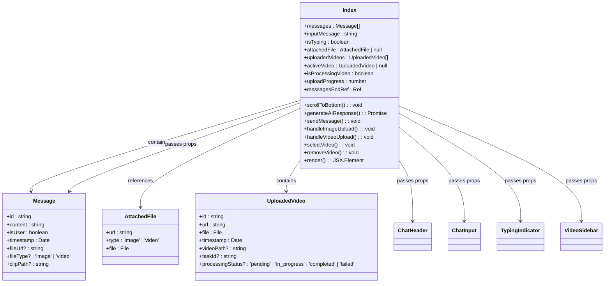

# User Interface

<cite>
**Referenced Files in This Document**   
- [App.tsx](file://vaas-ui/src/App.tsx)
- [Index.tsx](file://vaas-ui/src/pages/Index.tsx)
- [ChatHeader.tsx](file://vaas-ui/src/components/ChatHeader.tsx)
- [ChatInput.tsx](file://vaas-ui/src/components/ChatInput.tsx)
- [Message.tsx](file://vaas-ui/src/components/Message.tsx)
- [VideoSidebar.tsx](file://vaas-ui/src/components/VideoSidebar.tsx)
- [TypingIndicator.tsx](file://vaas-ui/src/components/TypingIndicator.tsx)
- [button.tsx](file://vaas-ui/src/components/ui/button.tsx)
- [input.tsx](file://vaas-ui/src/components/ui/input.tsx)
- [tailwind.config.ts](file://vaas-ui/tailwind.config.ts)
</cite>

## Table of Contents
1. [Introduction](#introduction)
2. [Project Structure](#project-structure)
3. [Core Components](#core-components)
4. [Architecture Overview](#architecture-overview)
5. [Detailed Component Analysis](#detailed-component-analysis)
6. [Component Hierarchy and State Management](#component-hierarchy-and-state-management)
7. [Interaction Patterns](#interaction-patterns)
8. [UI Libraries and Styling](#ui-libraries-and-styling)
9. [Accessibility and Responsive Design](#accessibility-and-responsive-design)
10. [Performance Optimization](#performance-optimization)
11. [Conclusion](#conclusion)

## Introduction
The vaas-ui application presents a sophisticated multimodal interface that enables users to interact with an AI system through text, images, and video content. Inspired by the HAL 9000 computer system from "2001: A Space Odyssey," the interface features a distinctive red-and-black color scheme with monospace typography, creating a retro-futuristic aesthetic. The UI is built with React and leverages modern web technologies to provide a seamless experience for uploading videos, sending messages with optional media attachments, and viewing AI-generated responses. This documentation details the architecture, components, and interaction patterns that make up this advanced user interface.

## Project Structure
The vaas-ui application follows a standard React project structure with components organized by functionality. The main application entry point is App.tsx, which sets up routing and global providers. The core UI components are located in the components directory, with primitive UI elements in the ui subdirectory. The Index page serves as the main application view, orchestrating all UI components and managing application state.


**Diagram sources**
- [App.tsx](file://vaas-ui/src/App.tsx#L1-L26)
- [Index.tsx](file://vaas-ui/src/pages/Index.tsx#L1-L365)

**Section sources**
- [App.tsx](file://vaas-ui/src/App.tsx#L1-L26)
- [Index.tsx](file://vaas-ui/src/pages/Index.tsx#L1-L365)

## Core Components
The vaas-ui application consists of several key components that work together to create a cohesive user experience. These components include ChatHeader for displaying the application title and status, ChatInput for message composition, Message for rendering conversation history, VideoSidebar for managing video content, and TypingIndicator for showing AI response generation. The components are designed to work in concert, with state managed at the Index level and passed down through props.

**Section sources**
- [ChatHeader.tsx](file://vaas-ui/src/components/ChatHeader.tsx#L1-L17)
- [ChatInput.tsx](file://vaas-ui/src/components/ChatInput.tsx#L1-L138)
- [Message.tsx](file://vaas-ui/src/components/Message.tsx#L1-L76)
- [VideoSidebar.tsx](file://vaas-ui/src/components/VideoSidebar.tsx#L1-L265)
- [TypingIndicator.tsx](file://vaas-ui/src/components/TypingIndicator.tsx#L1-L21)

## Architecture Overview
The vaas-ui application follows a component-based architecture with a clear separation of concerns. The Index component serves as the container, managing all application state and orchestrating the interaction between UI components. State is managed using React hooks (useState, useEffect), with data flowing from parent to child components through props. The application uses React Router for navigation, TanStack Query for data fetching, and Sonner for toast notifications.


**Diagram sources**
- [Index.tsx](file://vaas-ui/src/pages/Index.tsx#L1-L365)
- [App.tsx](file://vaas-ui/src/App.tsx#L1-L26)

## Detailed Component Analysis

### ChatHeader Component
The ChatHeader component displays the application title and system status. It features a minimalist design with the "vaas AI" title and "HAL 9000 COMPUTER SYSTEM" subtitle, accompanied by a pulsing red dot that indicates system activity. The component uses Tailwind CSS for styling, with a black background and red accents that maintain the retro-futuristic theme.

```mermaid
classDiagram
class ChatHeader {
+render() JSX.Element
}
ChatHeader --> "1" JSX.Element : returns
JSX.Element --> "div" : container
JSX.Element --> "h1" : title
JSX.Element --> "p" : subtitle
JSX.Element --> "div" : status indicator
```

**Diagram sources**
- [ChatHeader.tsx](file://vaas-ui/src/components/ChatHeader.tsx#L1-L17)

**Section sources**
- [ChatHeader.tsx](file://vaas-ui/src/components/ChatHeader.tsx#L1-L17)

### ChatInput Component
The ChatInput component provides a text input field with image attachment capabilities. Users can type messages and attach images from their device. The component includes a hidden file input that is triggered by a button, allowing users to select image files. When an image is attached, a preview is displayed with a remove button. The component also includes a send button that is disabled when no message content is present or when the AI is processing a response.


**Diagram sources**
- [ChatInput.tsx](file://vaas-ui/src/components/ChatInput.tsx#L1-L138)

**Section sources**
- [ChatInput.tsx](file://vaas-ui/src/components/ChatInput.tsx#L1-L138)

### Message Component
The Message component renders individual messages in the chat history, distinguishing between user messages and AI responses. User messages appear on the right side with a gray background, while AI responses appear on the left with a red background. The component can display text content, attached images or videos, and AI-generated video clips. Each message includes a timestamp and, for AI responses, a HAL 9000 eye logo as an avatar. The component uses Tailwind CSS for responsive styling and includes animations for smooth appearance.

```mermaid
classDiagram
class Message {
+id : string
+content : string
+isUser : boolean
+timestamp : Date
+fileUrl? : string
+fileType? : 'image' | 'video'
+clipPath? : string
+render() JSX.Element
}
Message --> "1" JSX.Element : returns
JSX.Element --> "div" : container
JSX.Element --> "div" : message bubble
JSX.Element --> "div" : header
JSX.Element --> "p" : content
JSX.Element --> "div" : timestamp
JSX.Element --> "img" : image attachment
JSX.Element --> "video" : video attachment
JSX.Element --> "video" : clip response
class MessageProps {
+id : string
+content : string
+isUser : boolean
+timestamp : Date
+fileUrl? : string
+fileType? : 'image' | 'video'
+clipPath? : string
}
Message --> MessageProps : uses
```

**Diagram sources**
- [Message.tsx](file://vaas-ui/src/components/Message.tsx#L1-L76)

**Section sources**
- [Message.tsx](file://vaas-ui/src/components/Message.tsx#L1-L76)

### VideoSidebar Component
The VideoSidebar component provides a dedicated interface for video management, positioned as a fixed panel on the right side of the screen. It allows users to upload videos, view processing status, select active videos for analysis, and remove videos from the library. Each video is displayed as a thumbnail with playback controls, status indicators, and a remove button. The component handles the complete video upload workflow, including file selection, API communication, progress tracking, and status updates.


**Diagram sources**
- [VideoSidebar.tsx](file://vaas-ui/src/components/VideoSidebar.tsx#L1-L265)

**Section sources**
- [VideoSidebar.tsx](file://vaas-ui/src/components/VideoSidebar.tsx#L1-L265)

### TypingIndicator Component
The TypingIndicator component provides visual feedback when the AI is generating a response. It appears as a message bubble on the left side of the chat interface with a "Processing..." text and three pulsing red dots that simulate typing activity. The component uses CSS animations to create the bouncing effect of the dots, with staggered animation delays to create a realistic typing indicator. The component is conditionally rendered based on the isTyping state managed by the parent Index component.

```mermaid
classDiagram
class TypingIndicator {
+render() JSX.Element
}
TypingIndicator --> "1" JSX.Element : returns
JSX.Element --> "div" : container
JSX.Element --> "div" : message bubble
JSX.Element --> "div" : sender
JSX.Element --> "div" : dots container
JSX.Element --> "div" : dot 1
JSX.Element --> "div" : dot 2
JSX.Element --> "div" : dot 3
JSX.Element --> "span" : "Processing..."
class CSSAnimations {
+animate-bounce : keyframes
+animationDelay : 0.1s, 0.2s
}
TypingIndicator --> CSSAnimations : uses
```

**Diagram sources**
- [TypingIndicator.tsx](file://vaas-ui/src/components/TypingIndicator.tsx#L1-L21)

**Section sources**
- [TypingIndicator.tsx](file://vaas-ui/src/components/TypingIndicator.tsx#L1-L21)

## Component Hierarchy and State Management
The vaas-ui application uses a centralized state management approach with React hooks. The Index component serves as the single source of truth for application state, managing messages, input values, attached files, uploaded videos, active video selection, and processing states. State is updated using useState hooks, with state changes triggering re-renders of dependent components. Effects are managed using useEffect hooks for side effects such as scrolling to the bottom of the chat, auto-selecting videos, and polling video processing status.



**Diagram sources**
- [Index.tsx](file://vaas-ui/src/pages/Index.tsx#L1-L365)

**Section sources**
- [Index.tsx](file://vaas-ui/src/pages/Index.tsx#L1-L365)

## Interaction Patterns

### Video Upload Process
The video upload process in vaas-ui follows a multi-step workflow that ensures reliable processing and user feedback. When a user uploads a video, the file is first sent to the backend API for storage. Upon successful upload, a processing task is initiated, and the frontend begins polling the server for status updates. The UI provides real-time feedback through a progress bar and status indicators, allowing users to track the processing progress. Once processing is complete, the video becomes available for analysis and can be selected as the active context for AI interactions.


**Section sources**
- [VideoSidebar.tsx](file://vaas-ui/src/components/VideoSidebar.tsx#L1-L265)
- [Index.tsx](file://vaas-ui/src/pages/Index.tsx#L1-L365)

### Message Sending with Optional Images
The message sending workflow supports both text-only messages and messages with image attachments. Users can compose text in the input field and optionally attach an image by clicking the image button. When the send button is clicked (or Enter is pressed), the message content and any attached file are packaged and sent to the AI service. The UI provides immediate feedback by adding the message to the chat history and displaying a typing indicator while awaiting the AI response. After receiving the response, both messages are rendered in the chat interface with appropriate styling.


**Section sources**
- [ChatInput.tsx](file://vaas-ui/src/components/ChatInput.tsx#L1-L138)
- [Index.tsx](file://vaas-ui/src/pages/Index.tsx#L1-L365)

### Response Viewing and Video Context
The response viewing pattern in vaas-ui integrates video context seamlessly into the AI interaction. When a user sends a message, the system automatically determines which video to use as context—either the currently active video or the most recently uploaded video if none is selected. AI responses may include text and, when relevant, video clips extracted from the analyzed video. These clips are displayed inline with the response, allowing users to immediately view the referenced content. The video sidebar maintains a library of all uploaded videos, enabling users to switch between different video contexts for subsequent interactions.


**Section sources**
- [Index.tsx](file://vaas-ui/src/pages/Index.tsx#L1-L365)
- [Message.tsx](file://vaas-ui/src/components/Message.tsx#L1-L76)
- [VideoSidebar.tsx](file://vaas-ui/src/components/VideoSidebar.tsx#L1-L265)

## UI Libraries and Styling
The vaas-ui application leverages several UI libraries and styling approaches to create a consistent and visually appealing interface. The primary styling is handled by Tailwind CSS, a utility-first CSS framework that allows for rapid UI development. The application uses a custom theme defined in tailwind.config.ts that implements a dark color scheme with red accents, evoking the HAL 9000 aesthetic. Component primitives from Radix UI are used for accessible UI elements like buttons and inputs, enhanced with class-variance-authority for consistent styling variants.


**Diagram sources**
- [tailwind.config.ts](file://vaas-ui/tailwind.config.ts#L1-L112)
- [button.tsx](file://vaas-ui/src/components/ui/button.tsx#L1-L57)
- [input.tsx](file://vaas-ui/src/components/ui/input.tsx#L1-L23)

**Section sources**
- [tailwind.config.ts](file://vaas-ui/tailwind.config.ts#L1-L112)
- [button.tsx](file://vaas-ui/src/components/ui/button.tsx#L1-L57)
- [input.tsx](file://vaas-ui/src/components/ui/input.tsx#L1-L23)

## Accessibility and Responsive Design
The vaas-ui application incorporates several accessibility features and responsive design principles to ensure usability across different devices and user needs. The interface uses semantic HTML elements and ARIA attributes to provide context for screen readers. Keyboard navigation is supported through standard tab ordering and Enter key activation of buttons. The layout is responsive, adapting to different screen sizes through Tailwind's responsive prefixes. On smaller screens, the video sidebar collapses or repositions to maintain usability. Color contrast meets WCAG guidelines, with sufficient contrast between text and background colors. Focus states are clearly visible, and interactive elements provide visual feedback on hover and focus.


**Section sources**
- [tailwind.config.ts](file://vaas-ui/tailwind.config.ts#L1-L112)
- [App.tsx](file://vaas-ui/src/App.tsx#L1-L26)
- [Index.tsx](file://vaas-ui/src/pages/Index.tsx#L1-L365)

## Performance Optimization
The vaas-ui application implements several performance optimizations to ensure smooth operation, particularly when handling large video files and extensive chat histories. Video thumbnails are rendered using object URLs created from file blobs, avoiding unnecessary server requests. The chat interface uses virtualization principles by only rendering visible messages and leveraging React's reconciliation algorithm for efficient updates. Network requests are optimized through proper error handling and retry logic. The application minimizes re-renders through careful state management and the use of React.memo where appropriate. Video processing status is polled at reasonable intervals (7 seconds) to balance real-time feedback with server load.


**Section sources**
- [Index.tsx](file://vaas-ui/src/pages/Index.tsx#L1-L365)
- [VideoSidebar.tsx](file://vaas-ui/src/components/VideoSidebar.tsx#L1-L265)
- [Message.tsx](file://vaas-ui/src/components/Message.tsx#L1-L76)

## Conclusion
The vaas-ui application presents a sophisticated multimodal interface that effectively combines text, image, and video interactions in a cohesive user experience. The component-based architecture, centered around the Index container component, provides a clear structure for state management and component communication. The use of modern React patterns, including hooks and functional components, enables efficient state management and reactivity. The integration of Tailwind CSS with component primitives from Radix UI ensures consistent styling and accessibility. The application's performance optimizations, particularly in video handling and chat rendering, contribute to a smooth user experience even with large media files. The retro-futuristic design aesthetic, inspired by HAL 9000, creates a distinctive visual identity while maintaining usability through thoughtful interaction patterns and responsive design. This documentation provides a comprehensive overview of the UI components, their relationships, and the underlying implementation patterns that make vaas-ui a robust platform for multimodal AI interactions.