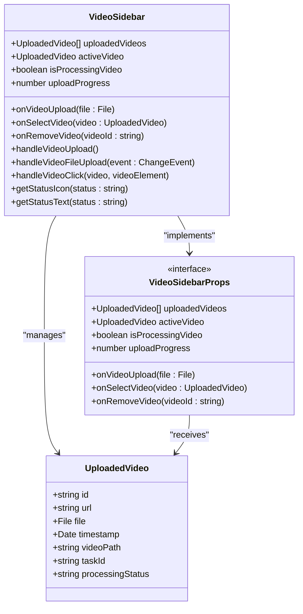
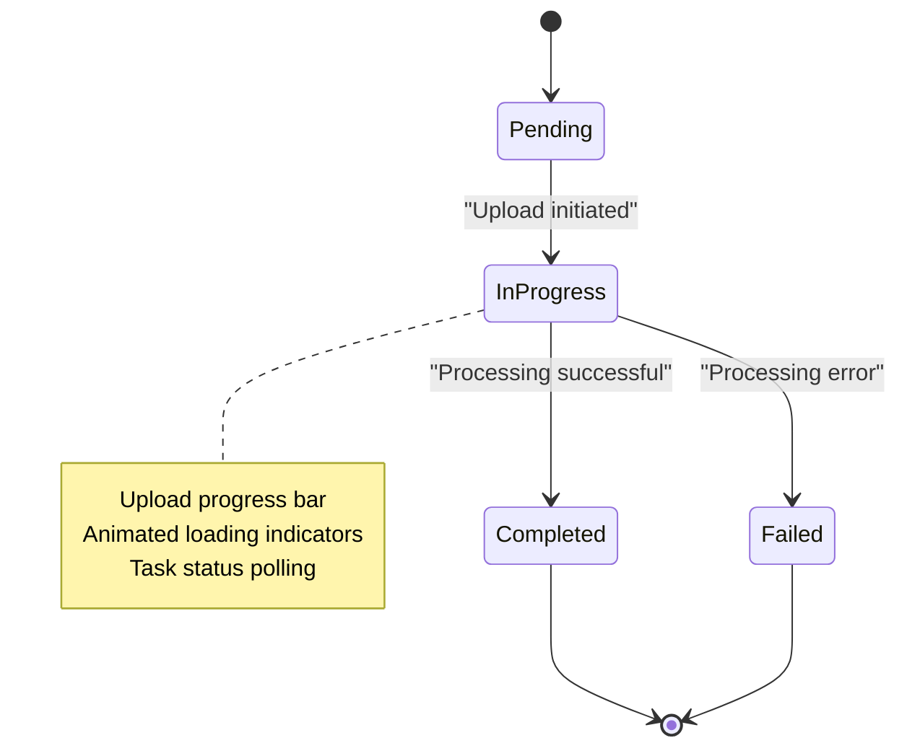
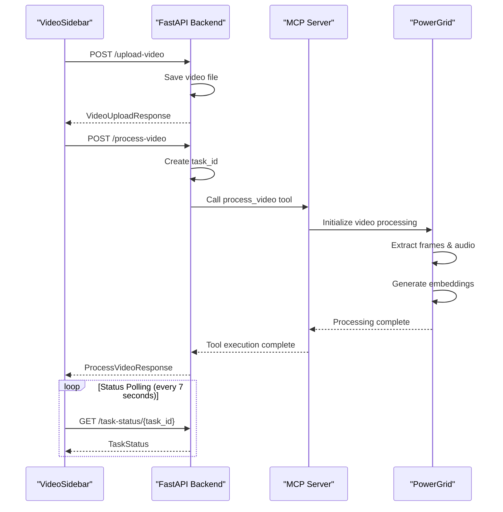
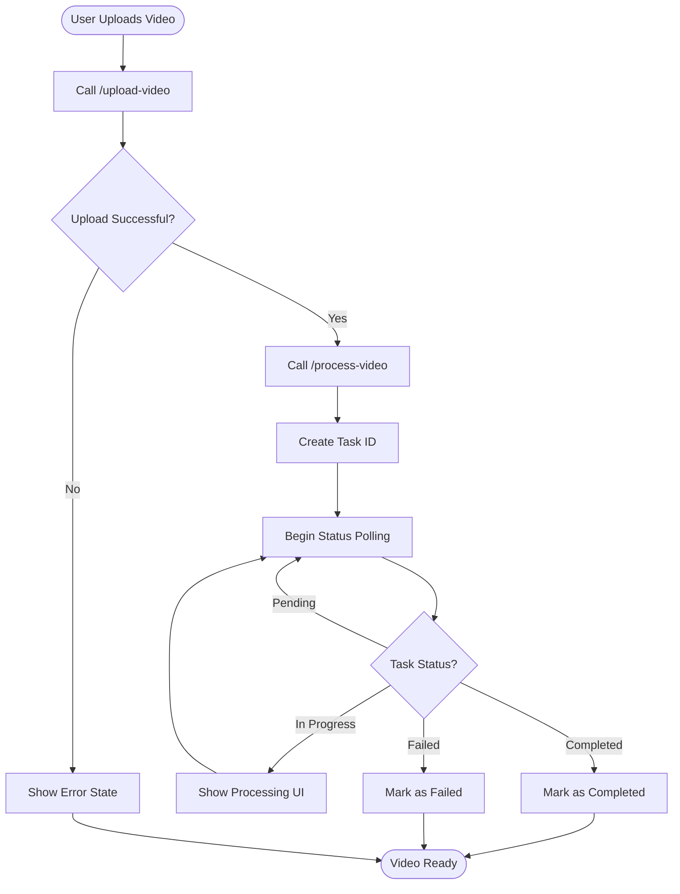
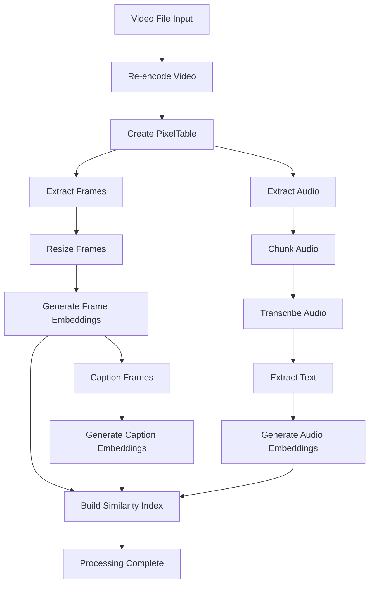

# Video Sidebar Component

<cite>
**Referenced Files in This Document**
- [VideoSidebar.tsx](file://vaas-ui/src/components/VideoSidebar.tsx)
- [Index.tsx](file://vaas-ui/src/pages/Index.tsx)
- [App.tsx](file://vaas-ui/src/App.tsx)
- [api.py](file://vaas-api/src/vaas_api/api.py)
- [models.py](file://vaas-api/src/vaas_api/models.py)
- [video_processor.py](file://vaas-mcp/src/vaas_mcp/video/ingestion/video_processor.py)
- [video_search_engine.py](file://vaas-mcp/src/vaas_mcp/video/video_search_engine.py)
- [tools.py](file://vaas-mcp/src/vaas_mcp/tools.py)
- [config.py](file://vaas-mcp/src/vaas_mcp/config.py)
- [button.tsx](file://vaas-ui/src/components/ui/button.tsx)
- [tailwind.config.ts](file://vaas-ui/tailwind.config.ts)
</cite>

## Table of Contents
1. [Introduction](#introduction)
2. [Component Architecture](#component-architecture)
3. [Core Features](#core-features)
4. [API Integration](#api-integration)
5. [State Management](#state-management)
6. [UI Components](#ui-components)
7. [Video Processing Pipeline](#video-processing-pipeline)
8. [Performance Optimization](#performance-optimization)
9. [Accessibility Considerations](#accessibility-considerations)
10. [Troubleshooting Guide](#troubleshooting-guide)
11. [Conclusion](#conclusion)

## Introduction

The VideoSidebar component is a sophisticated React component designed to manage video uploads, processing status tracking, and video selection for querying within the vaas multimodal agents course platform. This component serves as the central hub for video-related operations, providing users with an intuitive interface to upload videos, monitor processing progress, and select videos for AI-powered queries.

Built with modern React patterns and TypeScript, the VideoSidebar integrates seamlessly with the FastAPI backend through dedicated endpoints (`/upload-video` and `/process-video`) and leverages the PowerGrid video processing pipeline for advanced video analysis and indexing capabilities.

## Component Architecture

The VideoSidebar follows a functional component architecture with props-based communication, utilizing React's modern hooks and TypeScript for type safety. The component is designed as a fixed-position sidebar that overlays the main chat interface, providing easy access to video management functionality.



**Diagram sources**
- [VideoSidebar.tsx](file://vaas-ui/src/components/VideoSidebar.tsx#L1-L20)

**Section sources**
- [VideoSidebar.tsx](file://vaas-ui/src/components/VideoSidebar.tsx#L1-L265)

## Core Features

### Video Upload Management

The VideoSidebar provides comprehensive video upload capabilities with support for drag-and-drop functionality, file validation, and progress tracking. The component handles file selection through a hidden file input element, triggered programmatically to maintain consistent styling and user experience.

```typescript
// Core upload functionality
const handleVideoUpload = () => {
  if (videoInputRef.current) {
    videoInputRef.current.click();
  } else {
    console.error('VideoSidebar - videoInputRef is null!');
  }
};

const handleVideoFileUpload = (e: React.ChangeEvent<HTMLInputElement>) => {
  const file = e.target.files?.[0];
  if (file) {
    onVideoUpload(file);
  } else {
    console.log('No file selected');
  }
  // Reset the input so the same file can be selected again
  e.target.value = '';
};
```

### Processing Status Tracking

The component implements real-time processing status tracking with multiple states: pending, in-progress, completed, and failed. This enables users to monitor the progress of video processing operations and receive immediate feedback on operation outcomes.



### Video Selection and Playback

Users can select videos for querying through intuitive click interactions. The component manages video playback state, automatically pausing other videos when a new one is selected and providing visual feedback through status indicators and play/pause controls.

```typescript
const handleVideoClick = (video: UploadedVideo, videoElement: HTMLVideoElement) => {
  // Always select the video as active when clicked
  onSelectVideo(video);
  
  if (videoElement.paused) {
    // Pause all other videos first
    uploadedVideos.forEach((v) => {
      const otherVideo = document.getElementById(`video-${v.id}`) as HTMLVideoElement;
      if (otherVideo && otherVideo !== videoElement && !otherVideo.paused) {
        otherVideo.pause();
      }
    });
    videoElement.play();
  } else {
    videoElement.pause();
  }
};
```

**Section sources**
- [VideoSidebar.tsx](file://vaas-ui/src/components/VideoSidebar.tsx#L25-L96)

## API Integration

The VideoSidebar integrates with two primary API endpoints to handle video operations:

### Upload Endpoint (`/upload-video`)

The upload endpoint receives video files through multipart form data and stores them in the shared media directory. The endpoint validates file types, creates appropriate file paths, and returns the storage location for subsequent processing.

```python
@app.post("/upload-video", response_model=VideoUploadResponse)
async def upload_video(file: UploadFile = File(...)):
    """
    Upload a video and return the path
    """
    if not file.filename:
        raise HTTPException(status_code=400, detail="No file uploaded")

    try:
        shared_media_dir = Path("shared_media")
        shared_media_dir.mkdir(exist_ok=True)

        video_path = Path(shared_media_dir / file.filename)
        if not video_path.exists():
            with open(video_path, "wb") as f:
                shutil.copyfileobj(file.file, f)

        return VideoUploadResponse(message="Video uploaded successfully", video_path=str(video_path))
    except Exception as e:
        logger.error(f"Error uploading video: {e}")
        raise HTTPException(status_code=500, detail=str(e))
```

### Processing Endpoint (`/process-video`)

The processing endpoint initiates background video processing tasks using the PowerGrid video ingestion pipeline. This endpoint returns a task ID for status monitoring and triggers asynchronous processing operations.

```python
@app.post("/process-video")
async def process_video(request: ProcessVideoRequest, bg_tasks: BackgroundTasks, fastapi_request: Request):
    """
    Process a video and return the results
    """
    task_id = str(uuid4())
    bg_task_states = fastapi_request.app.state.bg_task_states

    async def background_process_video(video_path: str, task_id: str):
        bg_task_states[task_id] = TaskStatus.IN_PROGRESS

        if not Path(video_path).exists():
            bg_task_states[task_id] = TaskStatus.FAILED
            raise HTTPException(status_code=404, detail="Video file not found")

        try:
            mcp_client = Client(settings.MCP_SERVER)
            async with mcp_client:
                _ = await mcp_client.call_tool("process_video", {"video_path": request.video_path})
        except Exception as e:
            logger.error(f"Error processing video {video_path}: {e}")
            bg_task_states[task_id] = TaskStatus.FAILED
            raise HTTPException(status_code=500, detail=str(e))
        bg_task_states[task_id] = TaskStatus.COMPLETED

    bg_tasks.add_task(background_process_video, request.video_path, task_id)
    return ProcessVideoResponse(message="Task enqueued for processing", task_id=task_id)
```

### Task Status Monitoring

The frontend implements continuous polling to monitor task status through the `/task-status/{task_id}` endpoint, providing real-time updates on processing progress and completion status.



**Diagram sources**
- [api.py](file://vaas-api/src/vaas_api/api.py#L135-L178)
- [Index.tsx](file://vaas-ui/src/pages/Index.tsx#L70-L90)

**Section sources**
- [api.py](file://vaas-api/src/vaas_api/api.py#L135-L178)
- [models.py](file://vaas-api/src/vaas_api/models.py#L1-L54)

## State Management

The VideoSidebar coordinates with the parent component (Index.tsx) to maintain comprehensive state management for video operations. The state includes uploaded videos, active video selection, processing status, and upload progress tracking.

### State Structure

```typescript
interface UploadedVideo {
  id: string;
  url: string;
  file: File;
  timestamp: Date;
  videoPath?: string;
  taskId?: string;
  processingStatus?: 'pending' | 'in_progress' | 'completed' | 'failed';
}
```

### State Updates

The component receives state updates through props and manages local state for UI interactions. Key state transitions include:

- **Upload Initiation**: Sets `isProcessingVideo = true` and resets progress
- **Upload Progress**: Updates progress percentage during upload
- **Processing Start**: Creates video object with initial status
- **Status Updates**: Polls task status and updates video processing state
- **Completion**: Marks video as completed or failed based on task outcome



**Diagram sources**
- [Index.tsx](file://vaas-ui/src/pages/Index.tsx#L215-L270)

**Section sources**
- [Index.tsx](file://vaas-ui/src/pages/Index.tsx#L1-L365)
- [VideoSidebar.tsx](file://vaas-ui/src/components/VideoSidebar.tsx#L1-L20)

## UI Components

The VideoSidebar utilizes Tailwind CSS for responsive design and modern UI components built with Radix UI primitives. The component features a dark-themed interface with red accent colors, following the vaas brand identity.

### Layout Structure

The component is structured as a fixed-position sidebar with the following sections:

1. **Header Section**: Contains the upload button and processing animation
2. **Video Library**: Displays all uploaded videos with thumbnails and status
3. **Footer Section**: Includes hidden file input for programmatic access

### Responsive Design

The sidebar maintains consistent functionality across different screen sizes while adapting to mobile and desktop layouts. The fixed positioning ensures the sidebar remains accessible regardless of content scrolling.

### Visual Feedback System

The component provides comprehensive visual feedback through status indicators, progress bars, and interactive elements:

```typescript
const getStatusIcon = (status?: string) => {
  switch (status) {
    case 'in_progress':
      return <Loader2 className="w-4 h-4 text-yellow-500 animate-spin" />;
    case 'completed':
      return <CheckCircle className="w-4 h-4 text-green-500" />;
    case 'failed':
      return <AlertCircle className="w-4 h-4 text-red-500" />;
    default:
      return null;
  }
};
```

### Interactive Elements

- **Video Thumbnails**: Clickable video previews with play/pause controls
- **Status Badges**: Color-coded status indicators for processing state
- **Remove Buttons**: Hover-triggered delete buttons for video removal
- **Upload Button**: Primary action button with processing state indication

**Section sources**
- [VideoSidebar.tsx](file://vaas-ui/src/components/VideoSidebar.tsx#L98-L265)
- [tailwind.config.ts](file://vaas-ui/tailwind.config.ts#L1-L112)

## Video Processing Pipeline

The backend video processing pipeline leverages PowerGrid (PixelTable) for advanced video analysis and indexing. The pipeline performs comprehensive video processing including frame extraction, audio processing, embedding generation, and similarity indexing.

### Processing Workflow



**Diagram sources**
- [video_processor.py](file://vaas-mcp/src/vaas_mcp/video/ingestion/video_processor.py#L1-L205)

### Configuration Settings

The processing pipeline is configurable through environment settings that control various aspects of video processing:

```python
class Settings(BaseSettings):
    # Video Ingestion Configuration
    SPLIT_FRAMES_COUNT: int = 45
    AUDIO_CHUNK_LENGTH: int = 10
    AUDIO_OVERLAP_SECONDS: int = 1
    AUDIO_MIN_CHUNK_DURATION_SECONDS: int = 1
    
    # Embedding Models
    TRANSCRIPT_SIMILARITY_EMBD_MODEL: str = "text-embedding-3-small"
    IMAGE_SIMILARITY_EMBD_MODEL: str = "openai/clip-vit-base-patch32"
    CAPTION_SIMILARITY_EMBD_MODEL: str = "text-embedding-3-small"
    
    # Search Configuration
    VIDEO_CLIP_SPEECH_SEARCH_TOP_K: int = 1
    VIDEO_CLIP_CAPTION_SEARCH_TOP_K: int = 1
    VIDEO_CLIP_IMAGE_SEARCH_TOP_K: int = 1
    QUESTION_ANSWER_TOP_K: int = 3
```

### Search Capabilities

The processed video data enables multiple search modalities:

- **Speech Search**: Query video transcripts for relevant audio segments
- **Caption Search**: Search frame captions for visual content matching
- **Image Search**: Find video segments matching provided images
- **Question Answering**: Retrieve relevant captions based on user queries

**Section sources**
- [video_processor.py](file://vaas-mcp/src/vaas_mcp/video/ingestion/video_processor.py#L1-L205)
- [video_search_engine.py](file://vaas-mcp/src/vaas_mcp/video/video_search_engine.py#L1-L168)
- [config.py](file://vaas-mcp/src/vaas_mcp/config.py#L1-L56)

## Performance Optimization

The VideoSidebar implements several performance optimization strategies to handle large video libraries and ensure smooth user interactions.

### Memory Management

- **URL Object Cleanup**: Automatic cleanup of video URLs using `URL.revokeObjectURL()` when videos are removed
- **Efficient Rendering**: Conditional rendering of video thumbnails and status indicators
- **Polling Optimization**: Strategic polling intervals (7 seconds) to balance responsiveness with resource usage

### Rendering Optimization

- **Virtual Scrolling**: While not explicitly implemented, the component is designed to handle large video lists efficiently
- **Conditional Loading**: Video thumbnails load only when needed, reducing initial render time
- **Lazy Initialization**: Video processing tasks are queued asynchronously to prevent UI blocking

### Caching Strategies

- **PixelTable Caching**: Processed video data is cached for quick retrieval and reuse
- **Embedding Indexing**: Pre-computed embeddings enable fast similarity searches
- **Thumbnail Generation**: Processed frames are cached for thumbnail display

```typescript
const removeVideo = (videoId: string) => {
  const videoToRemove = uploadedVideos.find(v => v.id === videoId);
  if (videoToRemove) {
    URL.revokeObjectURL(videoToRemove.url);
    setUploadedVideos(prev => prev.filter(v => v.id !== videoId));
    if (activeVideo?.id === videoId) {
      setActiveVideo(null);
    }
  }
};
```

**Section sources**
- [Index.tsx](file://vaas-ui/src/pages/Index.tsx#L290-L300)

## Accessibility Considerations

The VideoSidebar incorporates several accessibility features to ensure usability for all users:

### Keyboard Navigation

- **Programmatic Focus**: File input is triggered programmatically, bypassing keyboard navigation limitations
- **Interactive Elements**: All buttons and controls support keyboard activation
- **Focus Management**: Proper focus indicators for interactive elements

### Screen Reader Support

- **Semantic HTML**: Proper use of HTML elements and ARIA attributes
- **Descriptive Labels**: Clear labeling for all interactive elements
- **Status Announcements**: Processing status updates announced to screen readers

### Visual Accessibility

- **High Contrast**: Red accents against black background provide good contrast
- **Clear Icons**: Lucide icons provide visual cues for actions
- **Status Indicators**: Color-coded status indicators with text alternatives

### Dynamic Content Updates

- **Progressive Enhancement**: Core functionality works without JavaScript
- **Loading States**: Clear loading indicators during processing operations
- **Error Handling**: Accessible error messages and recovery suggestions

## Troubleshooting Guide

### Common Issues and Solutions

#### Video Upload Failures

**Symptoms**: Upload button appears disabled or fails silently
**Causes**: 
- Network connectivity issues
- File size limitations
- Unsupported video formats

**Solutions**:
- Verify network connection stability
- Check file size compliance with server limits
- Ensure video format compatibility (.mp4, .avi, .mov supported)

#### Processing Status Not Updating

**Symptoms**: Video shows as "in progress" indefinitely
**Causes**:
- Background task failure
- Polling interval issues
- Task status service unavailable

**Solutions**:
- Check backend logs for processing errors
- Verify task status endpoint availability
- Restart processing if persistent issues occur

#### Video Playback Issues

**Symptoms**: Videos fail to play or show blank thumbnails
**Causes**:
- Corrupted video files
- Browser compatibility issues
- Memory limitations

**Solutions**:
- Verify video file integrity
- Test in different browsers
- Clear browser cache and retry

### Debug Information

The component includes comprehensive logging for debugging purposes:

```typescript
console.log('🎬 VideoSidebar - videoInputRef is null!');
console.log('🎬 VideoSidebar - No file selected');
console.log('🎬 Video ${video.id} started playing');
console.log('🎬 Video ${video.id} paused');
console.log('🎬 New video uploaded and set as active:', newVideo.videoPath);
```

**Section sources**
- [VideoSidebar.tsx](file://vaas-ui/src/components/VideoSidebar.tsx#L30-L40)
- [Index.tsx](file://vaas-ui/src/pages/Index.tsx#L250-L260)

## Conclusion

The VideoSidebar component represents a sophisticated solution for video management within the vaas multimodal agents course platform. By combining modern React patterns, robust API integration, and advanced video processing capabilities, the component provides users with an intuitive and powerful interface for video uploads, processing, and querying.

Key strengths of the implementation include:

- **Seamless Integration**: Clean separation of concerns with parent-child component communication
- **Real-time Feedback**: Comprehensive status tracking and progress indication
- **Performance Optimization**: Efficient memory management and rendering strategies
- **Accessibility Compliance**: Built-in accessibility features for inclusive user experiences
- **Scalability**: Designed to handle large video libraries and concurrent operations

The component's architecture demonstrates best practices in modern web development while providing the specialized functionality required for advanced video processing and AI-powered video analysis. Future enhancements could include virtual scrolling for large video libraries, enhanced error recovery mechanisms, and expanded search capabilities.