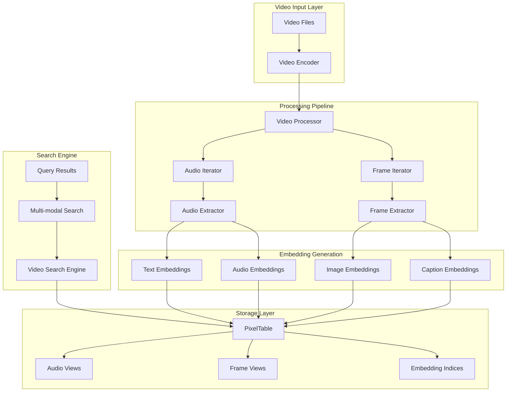
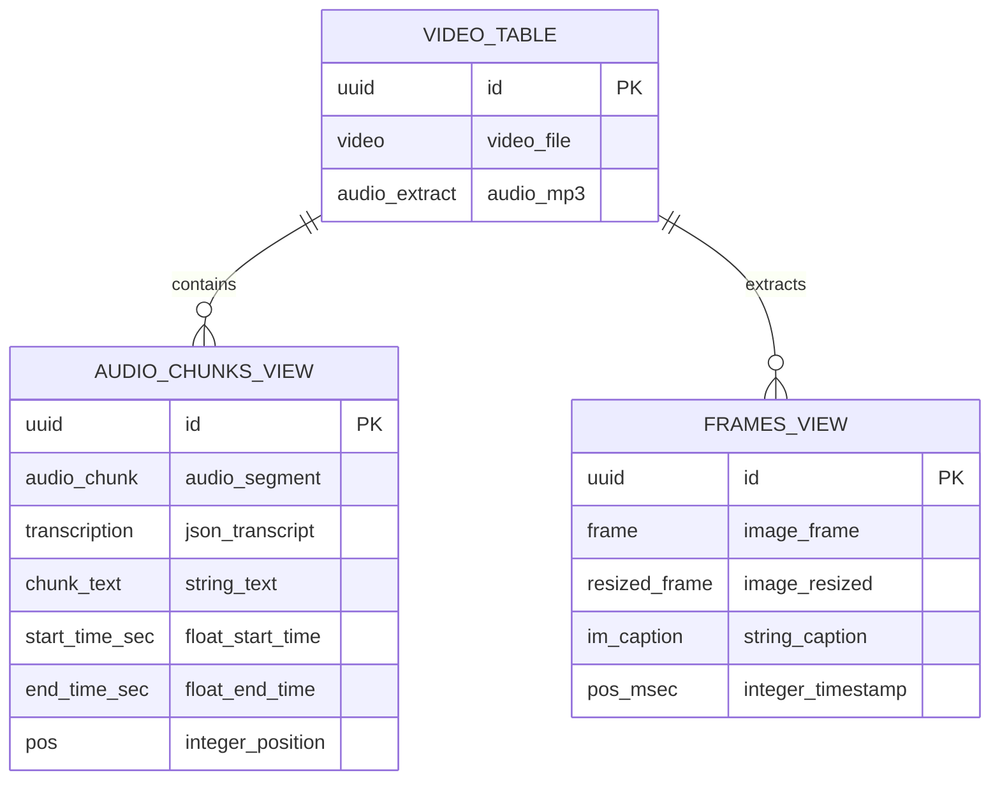
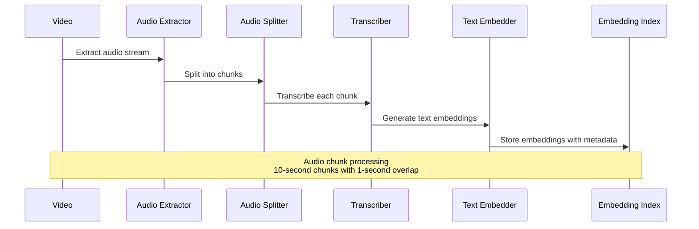
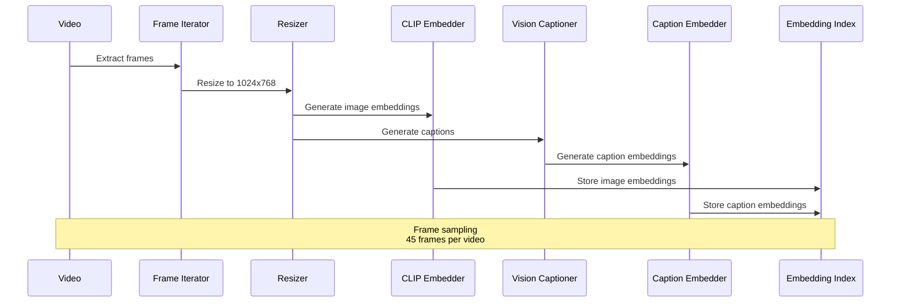
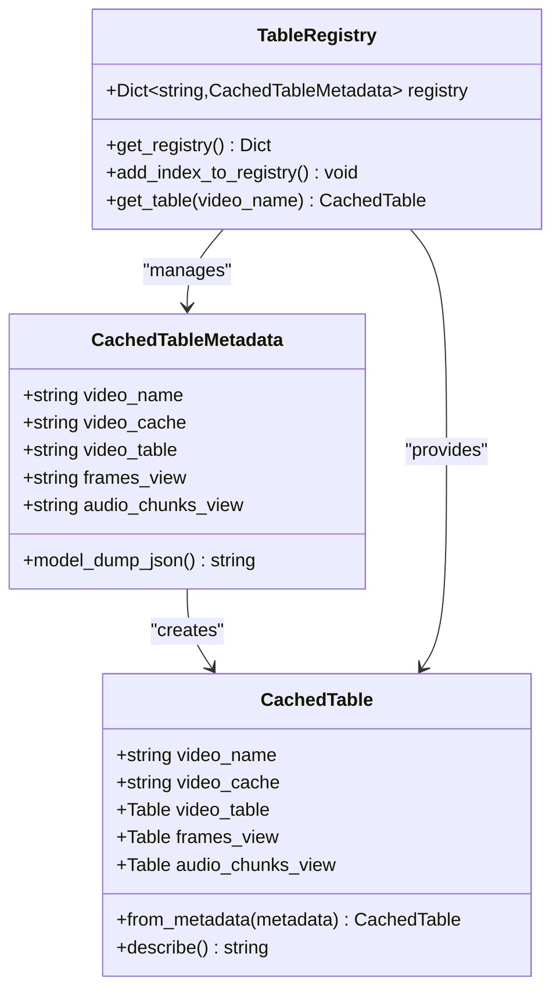
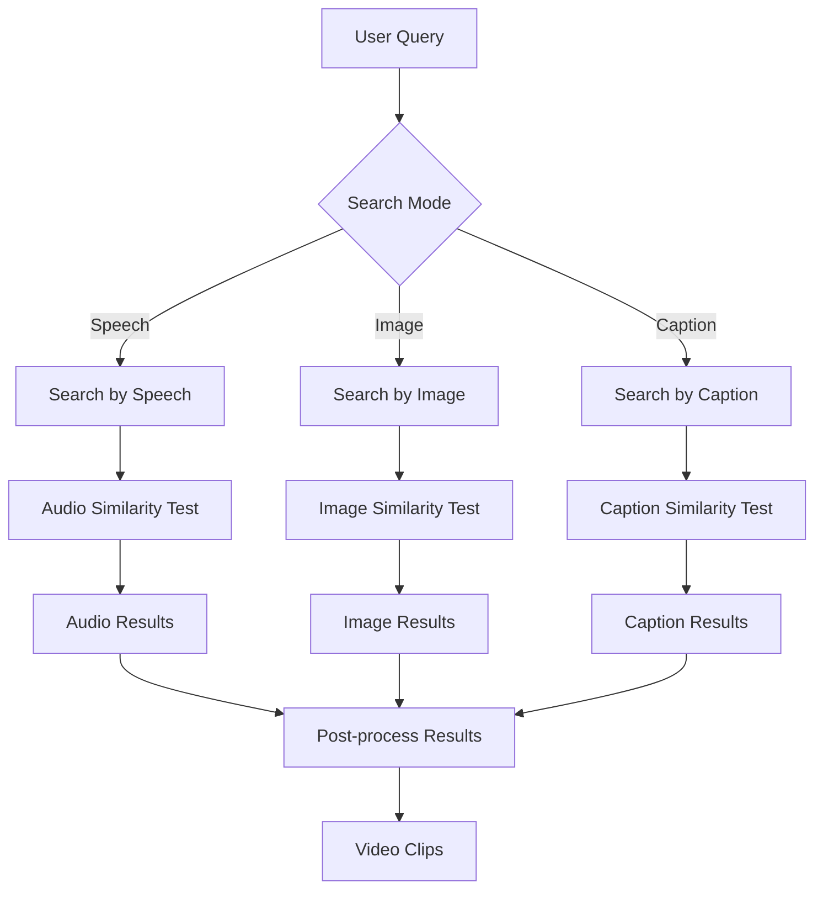
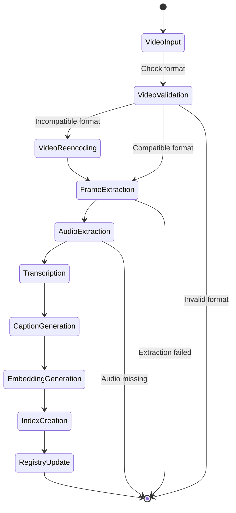

# Indexing Strategy

<cite>
**Referenced Files in This Document**
- [models.py](file://vaas-mcp/src/vaas_mcp/video/ingestion/models.py)
- [registry.py](file://vaas-mcp/src/vaas_mcp/video/ingestion/registry.py)
- [video_processor.py](file://vaas-mcp/src/vaas_mcp/video/ingestion/video_processor.py)
- [functions.py](file://vaas-mcp/src/vaas_mcp/video/ingestion/functions.py)
- [tools.py](file://vaas-mcp/src/vaas_mcp/video/ingestion/tools.py)
- [video_search_engine.py](file://vaas-mcp/src/vaas_mcp/video/video_search_engine.py)
- [config.py](file://vaas-mcp/src/vaas_mcp/config.py)
- [constants.py](file://vaas-mcp/src/vaas_mcp/video/ingestion/constants.py)
- [server.py](file://vaas-mcp/src/vaas_mcp/server.py)
- [tools.py](file://vaas-mcp/src/vaas_mcp/tools.py)
</cite>

## Table of Contents
1. [Introduction](#introduction)
2. [System Architecture](#system-architecture)
3. [Data Model Schema](#data-model-schema)
4. [Embedding Generation Process](#embedding-generation-process)
5. [Registry Management](#registry-management)
6. [Multimodal Search Capabilities](#multimodal-search-capabilities)
7. [Sample Queries and Usage Examples](#sample-queries-and-usage-examples)
8. [Data Lifecycle Management](#data-lifecycle-management)
9. [Scaling and Optimization](#scaling-and-optimization)
10. [Schema Migrations](#schema-migrations)
11. [Troubleshooting Guide](#troubleshooting-guide)
12. [Conclusion](#conclusion)

## Introduction

The vaas-MCP Indexing Strategy provides a comprehensive framework for structuring and indexing video content using PixelTable, enabling sophisticated multimodal search capabilities across text, audio, and visual modalities. This system transforms raw video content into searchable embeddings, allowing for precise clip retrieval and intelligent content discovery.

The indexing strategy focuses on four primary modalities:
- **Keyframes**: Visual snapshots extracted from video sequences
- **Transcripts**: Audio-to-text conversion of spoken content
- **Audio Embeddings**: Semantic representations of audio content
- **Visual Embeddings**: CLIP-based embeddings of video frames

## System Architecture

The indexing system follows a layered architecture that separates concerns between ingestion, processing, storage, and retrieval:



**Diagram sources**
- [video_processor.py](file://vaas-mcp/src/vaas_mcp/video/ingestion/video_processor.py#L25-L205)
- [video_search_engine.py](file://vaas-mcp/src/vaas_mcp/video/video_search_engine.py#L12-L168)

## Data Model Schema

The system uses PixelTable as its core data storage mechanism, organizing video content through a hierarchical schema structure:

### Core Table Structure



**Diagram sources**
- [models.py](file://vaas-mcp/src/vaas_mcp/video/ingestion/models.py#L15-L31)
- [video_processor.py](file://vaas-mcp/src/vaas_mcp/video/ingestion/video_processor.py#L85-L107)

### Cached Table Metadata

The system maintains registry metadata for efficient table management:

```python
class CachedTableMetadata(BaseModel):
    video_name: str = Field(..., description="Name of the video")
    video_cache: str = Field(..., description="Path to the video cache")
    video_table: str = Field(..., description="Root video table")
    frames_view: str = Field(..., description="Video frames view")
    audio_chunks_view: str = Field(..., description="Audio chunks view")
```

**Section sources**
- [models.py](file://vaas-mcp/src/vaas_mcp/video/ingestion/models.py#L15-L31)
- [models.py](file://vaas-mcp/src/vaas_mcp/video/ingestion/models.py#L33-L72)

## Embedding Generation Process

The embedding generation process creates semantic representations across multiple modalities, enabling cross-modal similarity search:

### Audio Processing Pipeline



**Diagram sources**
- [video_processor.py](file://vaas-mcp/src/vaas_mcp/video/ingestion/video_processor.py#L109-L143)

### Visual Processing Pipeline



**Diagram sources**
- [video_processor.py](file://vaas-mcp/src/vaas_mcp/video/ingestion/video_processor.py#L145-L180)

### Model Specifications

The system employs specific models for each modality:

| Modality | Model | Dimensionality | Purpose |
|----------|-------|----------------|---------|
| Audio Transcription | OpenAI GPT-4o-mini | Whisper tiny | Speech-to-text conversion |
| Audio Embeddings | OpenAI text-embedding-3-small | 1536 | Semantic similarity |
| Image Embeddings | OpenAI CLIP-ViT-B/32 | 512 | Visual similarity |
| Caption Embeddings | OpenAI text-embedding-3-small | 1536 | Caption similarity |

**Section sources**
- [config.py](file://vaas-mcp/src/vaas_mcp/config.py#L15-L35)
- [video_processor.py](file://vaas-mcp/src/vaas_mcp/video/ingestion/video_processor.py#L124-L185)

## Registry Management

The registry system manages indexed tables and versioning through a sophisticated caching mechanism:

### Registry Architecture



**Diagram sources**
- [models.py](file://vaas-mcp/src/vaas_mcp/video/ingestion/models.py#L15-L72)
- [registry.py](file://vaas-mcp/src/vaas_mcp/video/ingestion/registry.py#L15-L110)

### Versioning and Caching

The registry implements automatic versioning with timestamp-based file naming:

```python
def add_index_to_registry(
    video_name: str,
    video_cache: str,
    frames_view_name: str,
    audio_view_name: str,
):
    # Creates timestamped registry files
    dt = datetime.now()
    dtstr = dt.strftime("%Y-%m-%d%H:%M:%S")
    records_dir = Path(cc.DEFAULT_CACHED_TABLES_REGISTRY_DIR)
    records_dir.mkdir(parents=True, exist_ok=True)
    with open(records_dir / f"registry_{dtstr}.json", "w") as f:
        json.dump(VIDEO_INDEXES_REGISTRY, f, indent=4)
```

**Section sources**
- [registry.py](file://vaas-mcp/src/vaas_mcp/video/ingestion/registry.py#L61-L97)

## Multimodal Search Capabilities

The VideoSearchEngine provides comprehensive search capabilities across all indexed modalities:

### Search Methods



**Diagram sources**
- [video_search_engine.py](file://vaas-mcp/src/vaas_mcp/video/video_search_engine.py#L25-L168)

### Timestamp Synchronization

The system maintains precise temporal alignment across modalities:

```python
# Frame timestamp calculation
"start_time": entry["pos_msec"] / 1000.0 - settings.DELTA_SECONDS_FRAME_INTERVAL,
"end_time": entry["pos_msec"] / 1000.0 + settings.DELTA_SECONDS_FRAME_INTERVAL,

# Audio chunk timestamp extraction
"start_time": float(entry["start_time_sec"]),
"end_time": float(entry["end_time_sec"]),
```

**Section sources**
- [video_search_engine.py](file://vaas-mcp/src/vaas_mcp/video/video_search_engine.py#L44-L92)
- [video_search_engine.py](file://vaas-mcp/src/vaas_mcp/video/video_search_engine.py#L94-L121)

## Sample Queries and Usage Examples

### Basic Video Processing

```python
from vaas_mcp.video.ingestion.video_processor import VideoProcessor

# Initialize processor
processor = VideoProcessor()
processor.setup_table("my_video.mp4")

# Add video to index
processor.add_video("path/to/video.mp4")
```

### Multimodal Search Examples

```python
from vaas_mcp.video.video_search_engine import VideoSearchEngine

# Initialize search engine
search_engine = VideoSearchEngine("my_video.mp4")

# Search by speech
speech_results = search_engine.search_by_speech(
    "What is the main topic?", 
    top_k=5
)

# Search by image
image_results = search_engine.search_by_image(
    base64_image_data, 
    top_k=5
)

# Search by caption
caption_results = search_engine.search_by_caption(
    "a person speaking", 
    top_k=5
)
```

### Tool Integration Examples

```python
# Extract video clip based on query
from vaas_mcp.tools import get_video_clip_from_user_query

clip_path = get_video_clip_from_user_query(
    video_path="path/to/video.mp4",
    user_query="find the scene with birds"
)

# Ask questions about video content
from vaas_mcp.tools import ask_question_about_video

answer = ask_question_about_video(
    video_path="path/to/video.mp4",
    user_query="what did the character say?"
)
```

**Section sources**
- [tools.py](file://vaas-mcp/src/vaas_mcp/tools.py#L39-L103)
- [server.py](file://vaas-mcp/src/vaas_mcp/server.py#L10-L40)

## Data Lifecycle Management

### Video Processing Workflow



### Retention Policies

The system implements configurable retention policies through:

- **Audio Chunk Duration**: 10 seconds per chunk with 1-second overlap
- **Frame Sampling Rate**: 45 frames per video
- **Cache Management**: Automatic cleanup of temporary processing files
- **Registry Versioning**: Historical registry snapshots for rollback capability

**Section sources**
- [config.py](file://vaas-mcp/src/vaas_mcp/config.py#L20-L25)
- [video_processor.py](file://vaas-mcp/src/vaas_mcp/video/ingestion/video_processor.py#L109-L143)

## Scaling and Optimization

### Approximate Nearest Neighbor Indexing

The system leverages PixelTable's built-in ANN capabilities for efficient similarity search:

```python
# Audio chunk similarity search
sims = self.video_index.audio_chunks_view.chunk_text.similarity(query)
results = self.video_index.audio_chunks_view.select(
    self.video_index.audio_chunks_view.start_time_sec,
    self.video_index.audio_chunks_view.end_time_sec,
    similarity=sims,
).order_by(sims, asc=False)
```

### Performance Optimizations

1. **Parallel Processing**: Audio and visual processing occur concurrently
2. **Batch Operations**: Multiple embeddings generated in single operations
3. **Caching Strategy**: LRU cache for registry lookups
4. **Memory Management**: Efficient image resizing and processing

### Large Collection Scaling

For large video collections, consider:

- **Distributed Processing**: Parallel video processing across multiple workers
- **Incremental Indexing**: Add new videos without reprocessing existing content
- **Resource Pooling**: Shared embedding model instances
- **Storage Optimization**: Compressed storage formats for embeddings

**Section sources**
- [video_processor.py](file://vaas-mcp/src/vaas_mcp/video/ingestion/video_processor.py#L145-L185)
- [video_search_engine.py](file://vaas-mcp/src/vaas_mcp/video/video_search_engine.py#L34-L62)

## Schema Migrations

### Version Control Strategy

The registry system provides version control through timestamped snapshots:

```python
# Registry files are named with timestamps
registry_2024-01-1510:30:45.json
registry_2024-01-1511:15:23.json
registry_2024-01-1512:45:10.json
```

### Migration Procedures

1. **Backup Current State**: Snapshot registry before migration
2. **Schema Validation**: Verify compatibility with new schema
3. **Incremental Updates**: Apply changes incrementally to avoid downtime
4. **Rollback Capability**: Restore from previous registry snapshot if needed

### Compatibility Guidelines

- **Backward Compatibility**: New versions support older registry formats
- **Forward Compatibility**: Registry updates require system upgrades
- **Schema Evolution**: Add new computed columns without breaking existing indices

**Section sources**
- [registry.py](file://vaas-mcp/src/vaas_mcp/video/ingestion/registry.py#L25-L60)

## Troubleshooting Guide

### Common Issues and Solutions

#### Video Format Compatibility
**Problem**: Videos fail to process due to unsupported formats
**Solution**: The system automatically re-encodes videos using FFmpeg
```python
# Automatic re-encoding handled by tools.py
re_encoded_path = re_encode_video(original_video_path)
```

#### Memory Issues During Processing
**Problem**: Out of memory errors during frame processing
**Solution**: Adjust frame sampling rate and image dimensions
```python
# Configurable parameters in config.py
IMAGE_RESIZE_WIDTH: int = 1024
IMAGE_RESIZE_HEIGHT: int = 768
SPLIT_FRAMES_COUNT: int = 45
```

#### Embedding Index Corruption
**Problem**: Embedding indices become corrupted or outdated
**Solution**: Rebuild indices using the replace_force option
```python
# Force rebuild of embedding indices
self.frames_view.add_embedding_index(
    column=self.frames_view.resized_frame,
    image_embed=clip.using(model_id=settings.IMAGE_SIMILARITY_EMBD_MODEL),
    if_exists="replace_force",
)
```

#### Registry Access Failures
**Problem**: Cannot access video indices from registry
**Solution**: Verify registry file permissions and existence
```python
# Registry validation
registry_files = [
    f for f in os.listdir(cc.DEFAULT_CACHED_TABLES_REGISTRY_DIR)
    if f.startswith("registry_") and f.endswith(".json")
]
```

**Section sources**
- [tools.py](file://vaas-mcp/src/vaas_mcp/video/ingestion/tools.py#L100-L155)
- [video_processor.py](file://vaas-mcp/src/vaas_mcp/video/ingestion/video_processor.py#L169-L185)
- [registry.py](file://vaas-mcp/src/vaas_mcp/video/ingestion/registry.py#L25-L60)

## Conclusion

The vaas-MCP Indexing Strategy provides a robust foundation for multimodal video search through PixelTable. By systematically extracting and indexing audio, visual, and textual content, the system enables sophisticated search capabilities across multiple modalities.

Key strengths of the system include:

- **Comprehensive Coverage**: Multi-modal indexing ensures broad content accessibility
- **Scalable Architecture**: Designed for processing large video collections efficiently
- **Flexible Search**: Support for various query types and modalities
- **Robust Management**: Comprehensive registry and versioning system
- **Performance Optimization**: Built-in ANN indexing and caching mechanisms

The system's modular design allows for easy extension and customization, making it suitable for a wide range of video processing and search applications. Future enhancements could include support for additional modalities, distributed processing capabilities, and advanced analytics features.