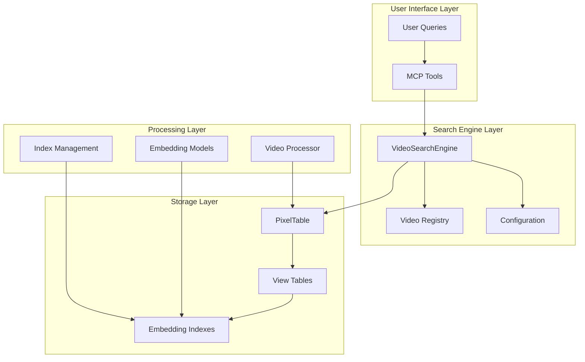
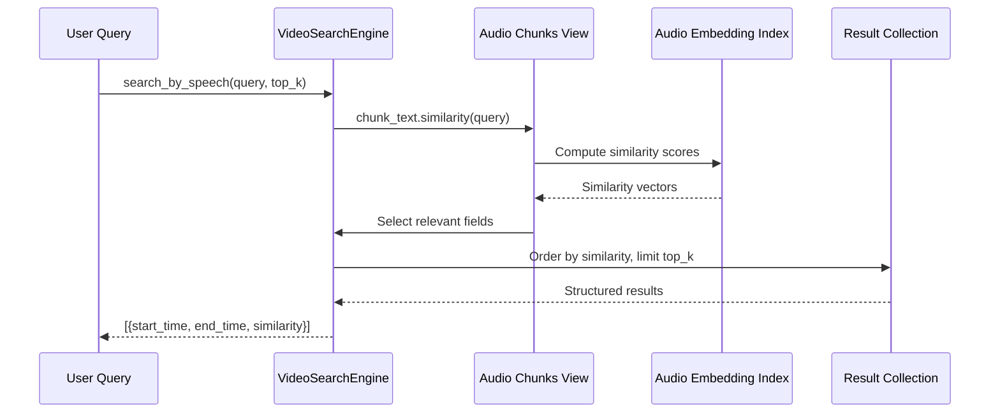
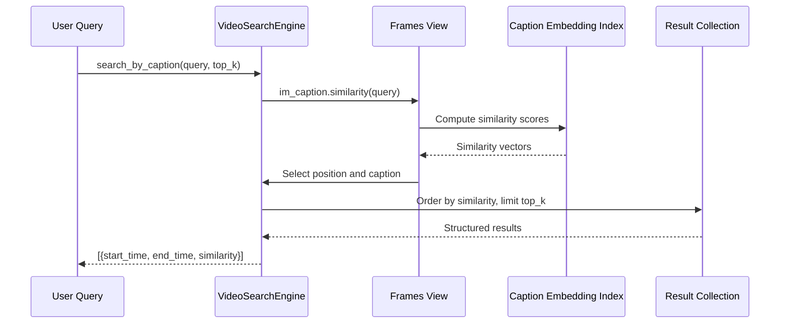
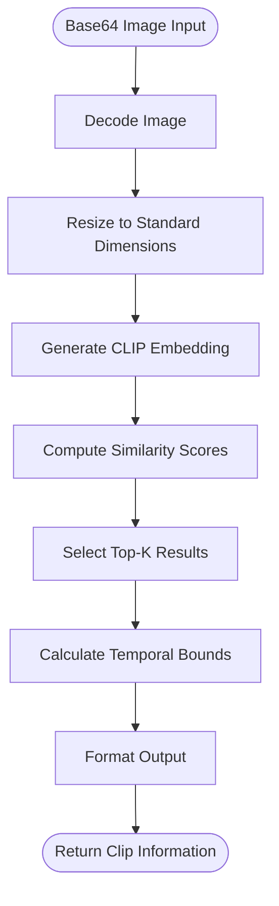
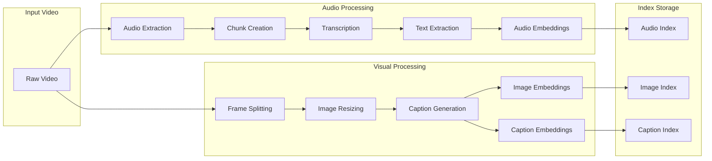
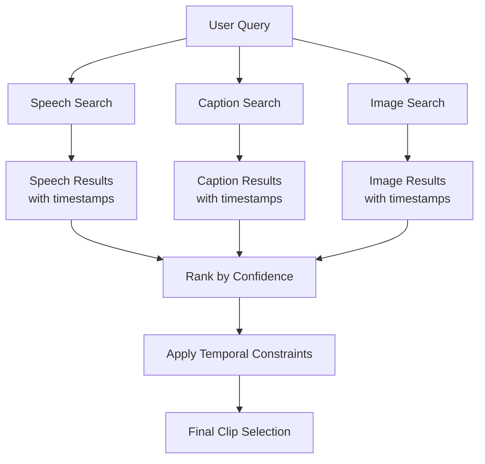
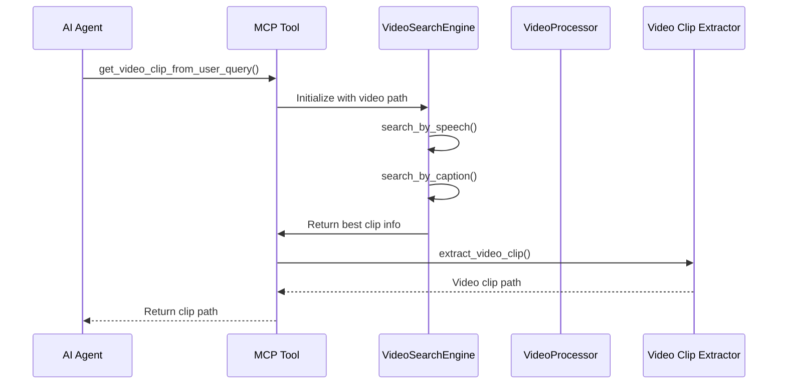

# Search Algorithms

<cite>
**Referenced Files in This Document**
- [video_search_engine.py](file://vaas-mcp/src/vaas_mcp/video/video_search_engine.py)
- [config.py](file://vaas-mcp/src/vaas_mcp/config.py)
- [registry.py](file://vaas-mcp/src/vaas_mcp/video/ingestion/registry.py)
- [models.py](file://vaas-mcp/src/vaas_mcp/video/ingestion/models.py)
- [tools.py](file://vaas-mcp/src/vaas_mcp/tools.py)
- [video_processor.py](file://vaas-mcp/src/vaas_mcp/video/ingestion/video_processor.py)
- [functions.py](file://vaas-mcp/src/vaas_mcp/video/ingestion/functions.py)
- [constants.py](file://vaas-mcp/src/vaas_mcp/video/ingestion/constants.py)
</cite>

## Table of Contents
1. [Introduction](#introduction)
2. [System Architecture](#system-architecture)
3. [Core Search Components](#core-search-components)
4. [Multi-Modal Search Implementation](#multi-modal-search-implementation)
5. [Embedding Generation and Indexing](#embedding-generation-and-indexing)
6. [Hybrid Search Approach](#hybrid-search-approach)
7. [Performance Optimization](#performance-optimization)
8. [Query Processing Pipeline](#query-processing-pipeline)
9. [Troubleshooting Guide](#troubleshooting-guide)
10. [Optimization Recommendations](#optimization-recommendations)

## Introduction

The vaas video search engine implements a sophisticated multi-modal search system that enables users to find relevant video content through text-based queries, image-based similarity, and speech recognition. The system leverages advanced embedding techniques and similarity search algorithms to provide precise results across different modalities.

The search engine operates on pre-processed video content that has been indexed with multiple representations: audio transcripts, frame captions, and visual embeddings. This multi-layered approach allows for flexible querying while maintaining high precision and recall across different types of content.

## System Architecture

The search system follows a modular architecture with clear separation of concerns:



**Diagram sources**
- [video_search_engine.py](file://vaas-mcp/src/vaas_mcp/video/video_search_engine.py#L1-L168)
- [registry.py](file://vaas-mcp/src/vaas_mcp/video/ingestion/registry.py#L1-L110)
- [video_processor.py](file://vaas-mcp/src/vaas_mcp/video/ingestion/video_processor.py#L1-L205)

## Core Search Components

### VideoSearchEngine Class

The `VideoSearchEngine` serves as the central orchestrator for all search operations. It maintains connections to pre-processed video data and provides unified interfaces for different search modalities.

```python
class VideoSearchEngine:
    """A class that provides video search capabilities using different modalities."""

    def __init__(self, video_name: str):
        """Initialize the video search engine."""
        self.video_index: CachedTable = registry.get_table(video_name)
        self.video_name = video_name
```

The engine initializes with a video index reference and validates its existence in the registry. This design ensures efficient resource utilization and prevents redundant initialization overhead.

**Section sources**
- [video_search_engine.py](file://vaas-mcp/src/vaas_mcp/video/video_search_engine.py#L10-L25)

### Multi-Modal Search Methods

The system implements three primary search methods, each optimized for different content types:

#### Speech-Based Search
```python
def search_by_speech(self, query: str, top_k: int) -> List[Dict[str, Any]]:
    """Search video clips by speech similarity."""
    sims = self.video_index.audio_chunks_view.chunk_text.similarity(query)
    results = self.video_index.audio_chunks_view.select(
        self.video_index.audio_chunks_view.pos,
        self.video_index.audio_chunks_view.start_time_sec,
        self.video_index.audio_chunks_view.end_time_sec,
        similarity=sims,
    ).order_by(sims, asc=False)
```

#### Image-Based Search
```python
def search_by_image(self, image_base64: str, top_k: int) -> List[Dict[str, Any]]:
    """Search video clips by image similarity."""
    image = decode_image(image_base64)
    sims = self.video_index.frames_view.resized_frame.similarity(image)
    results = self.video_index.frames_view.select(
        self.video_index.frames_view.pos_msec,
        self.video_index.frames_view.resized_frame,
        similarity=sims,
    ).order_by(sims, asc=False)
```

#### Caption-Based Search
```python
def search_by_caption(self, query: str, top_k: int) -> List[Dict[str, Any]]:
    """Search video clips by caption similarity."""
    sims = self.video_index.frames_view.im_caption.similarity(query)
    results = self.video_index.frames_view.select(
        self.video_index.frames_view.pos_msec,
        self.video_index.frames_view.im_caption,
        similarity=sims,
    ).order_by(sims, asc=False)
```

Each method follows a consistent pattern: compute similarity scores, select relevant fields, order by similarity, and return structured results with temporal information.

**Section sources**
- [video_search_engine.py](file://vaas-mcp/src/vaas_mcp/video/video_search_engine.py#L27-L168)

## Multi-Modal Search Implementation

### Text-Based Search

The text-based search system handles two primary modalities: speech transcription and frame captions.

#### Speech Search Implementation

Speech search operates on transcribed audio chunks, leveraging OpenAI's embedding models for semantic similarity:



**Diagram sources**
- [video_search_engine.py](file://vaas-mcp/src/vaas_mcp/video/video_search_engine.py#L27-L48)

#### Caption Search Implementation

Caption search utilizes pre-computed image captions generated by vision-language models:



**Diagram sources**
- [video_search_engine.py](file://vaas-mcp/src/vaas_mcp/video/video_search_engine.py#L89-L110)

### Image-Based Search

Image-based search leverages CLIP embeddings to find visually similar content:



**Diagram sources**
- [video_search_engine.py](file://vaas-mcp/src/vaas_mcp/video/video_search_engine.py#L50-L88)

**Section sources**
- [video_search_engine.py](file://vaas-mcp/src/vaas_mcp/video/video_search_engine.py#L27-L110)

## Embedding Generation and Indexing

### Preprocessing Pipeline

The video processing pipeline generates multiple embeddings for comprehensive search coverage:



**Diagram sources**
- [video_processor.py](file://vaas-mcp/src/vaas_mcp/video/ingestion/video_processor.py#L80-L205)

### Embedding Model Configuration

The system uses different models optimized for each modality:

- **Audio Embeddings**: OpenAI's `text-embedding-3-small` for semantic understanding
- **Image Embeddings**: OpenAI's `clip-vit-base-patch32` for visual similarity
- **Caption Embeddings**: OpenAI's `text-embedding-3-small` for textual content

**Section sources**
- [config.py](file://vaas-mcp/src/vaas_mcp/config.py#L25-L35)
- [video_processor.py](file://vaas-mcp/src/vaas_mcp/video/ingestion/video_processor.py#L120-L140)

## Hybrid Search Approach

### Multi-Modal Fusion

The system implements a hybrid approach that combines multiple search modalities to improve recall and relevance:

```python
def get_video_clip_from_user_query(video_path: str, user_query: str) -> str:
    """Get a video clip based on the user query using speech and caption similarity."""
    search_engine = VideoSearchEngine(video_path)

    speech_clips = search_engine.search_by_speech(user_query, settings.VIDEO_CLIP_SPEECH_SEARCH_TOP_K)
    caption_clips = search_engine.search_by_caption(user_query, settings.VIDEO_CLIP_CAPTION_SEARCH_TOP_K)

    speech_sim = speech_clips[0]["similarity"] if speech_clips else 0
    caption_sim = caption_clips[0]["similarity"] if caption_clips else 0

    video_clip_info = speech_clips[0] if speech_sim > caption_sim else caption_clips[0]
```

This approach implements a confidence-based selection mechanism where the highest-scoring modality determines the final result. The system maintains separate top-k configurations for different modalities to balance precision and recall.

### Temporal Constraint Integration

The search system incorporates temporal constraints to ensure results are relevant within the video timeline:



**Diagram sources**
- [tools.py](file://vaas-mcp/src/vaas_mcp/tools.py#L35-L60)

**Section sources**
- [tools.py](file://vaas-mcp/src/vaas_mcp/tools.py#L35-L60)

## Performance Optimization

### Caching Strategies

The system implements several caching mechanisms to optimize performance:

#### Registry Caching
```python
@lru_cache(maxsize=1)
def get_registry() -> Dict[str, CachedTableMetadata]:
    """Get the global video index registry."""
    global VIDEO_INDEXES_REGISTRY
    if not VIDEO_INDEXES_REGISTRY:
        # Load registry from disk
        registry_files = [
            f for f in os.listdir(cc.DEFAULT_CACHED_TABLES_REGISTRY_DIR)
            if f.startswith("registry_") and f.endswith(".json")
        ]
        # Load latest registry file
```

#### Embedding Index Caching
The system caches computed embeddings to avoid recomputation and enable fast similarity searches.

### Configuration Parameters

Key performance parameters are configurable through the settings system:

- **SPLIT_FRAMES_COUNT**: Controls frame sampling rate (default: 45)
- **AUDIO_CHUNK_LENGTH**: Audio chunk duration in seconds (default: 10)
- **IMAGE_RESIZE_WIDTH/HEIGHT**: Standard image dimensions (default: 1024x768)
- **DELTA_SECONDS_FRAME_INTERVAL**: Temporal window around search results (default: 5.0)

**Section sources**
- [config.py](file://vaas-mcp/src/vaas_mcp/config.py#L15-L35)
- [registry.py](file://vaas-mcp/src/vaas_mcp/video/ingestion/registry.py#L15-L35)

## Query Processing Pipeline

### Tool Integration

The search system integrates seamlessly with MCP tools for practical applications:



**Diagram sources**
- [tools.py](file://vaas-mcp/src/vaas_mcp/tools.py#L35-L60)

### Result Aggregation

The system aggregates results from multiple search modalities and applies ranking strategies:

1. **Confidence Scoring**: Each modality computes similarity scores independently
2. **Threshold Filtering**: Results below confidence thresholds are filtered out
3. **Temporal Alignment**: Clips are aligned to maintain temporal coherence
4. **Diversity Enhancement**: Top-k results ensure diverse coverage of content

**Section sources**
- [tools.py](file://vaas-mcp/src/vaas_mcp/tools.py#L35-L105)

## Troubleshooting Guide

### Common Issues and Solutions

#### Low Relevance Results
**Symptoms**: Search results are not semantically relevant to queries
**Causes**: 
- Insufficient training data for embedding models
- Poor quality of pre-processed content
- Suboptimal similarity thresholds

**Solutions**:
1. Increase `top_k` parameters to explore more candidates
2. Verify embedding model configurations
3. Check video processing pipeline for errors
4. Review query preprocessing techniques

#### Slow Response Times
**Symptoms**: Search operations take excessive time
**Causes**:
- Large video indices without proper indexing
- Inefficient similarity computations
- Network latency for external APIs

**Solutions**:
1. Optimize embedding index creation
2. Implement result caching strategies
3. Use local embedding models when possible
4. Monitor API rate limits and quotas

#### Memory Issues
**Symptoms**: Out-of-memory errors during search operations
**Causes**:
- Large video files consuming excessive memory
- Inefficient data structures
- Memory leaks in processing pipeline

**Solutions**:
1. Implement streaming processing for large videos
2. Use memory-efficient data types
3. Add garbage collection checkpoints
4. Monitor memory usage patterns

### Debugging Techniques

#### Enable Logging
```python
import loguru
logger = loguru.logger.bind(name="VideoSearchEngine")
logger.info(f"Search results: {results}")
```

#### Monitor Performance Metrics
- Search latency per modality
- Memory usage during operations
- API call frequency and costs
- Index hit rates

#### Validate Data Integrity
- Verify embedding index completeness
- Check temporal alignment of results
- Validate similarity score distributions

**Section sources**
- [video_search_engine.py](file://vaas-mcp/src/vaas_mcp/video/video_search_engine.py#L1-L168)

## Optimization Recommendations

### Query Preprocessing

#### Text Normalization
- Convert queries to lowercase for consistent matching
- Remove special characters and stopwords
- Apply stemming or lemmatization for better recall
- Handle synonyms and word variations

#### Image Preprocessing
- Standardize image dimensions before embedding
- Apply noise reduction for better visual matching
- Normalize color spaces for consistent results
- Handle aspect ratio preservation

### Index Tuning

#### Embedding Model Selection
Choose appropriate models based on use case:
- **High Precision**: More expensive but accurate models
- **High Recall**: Faster models with acceptable accuracy
- **Balanced**: Models optimized for both metrics

#### Index Maintenance
- Regular reindexing for updated content
- Periodic evaluation of embedding quality
- Monitoring of index performance metrics
- Automated cleanup of stale entries

### Infrastructure Scaling

#### Horizontal Scaling
- Distribute search load across multiple instances
- Implement sharding for large video collections
- Use distributed embedding storage
- Scale similarity computation horizontally

#### Vertical Scaling
- Increase memory allocation for larger indices
- Use faster storage for embedding data
- Optimize CPU usage for embedding generation
- Implement efficient caching strategies

### Monitoring and Alerting

#### Key Performance Indicators
- Average search latency
- Index update frequency
- API response times
- Error rates by modality

#### Alerting Thresholds
- Latency exceeding 5 seconds
- Index update failures
- API quota exhaustion
- Memory usage above 80%

These recommendations provide a comprehensive framework for optimizing the search system based on specific deployment requirements and performance characteristics.