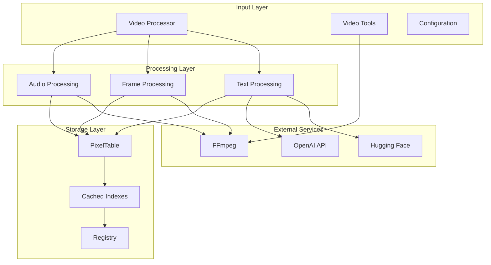
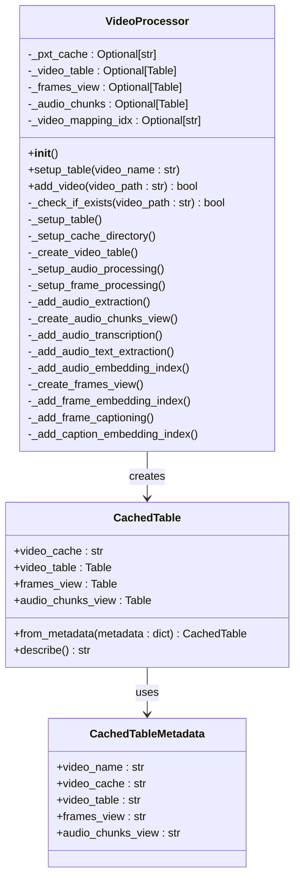
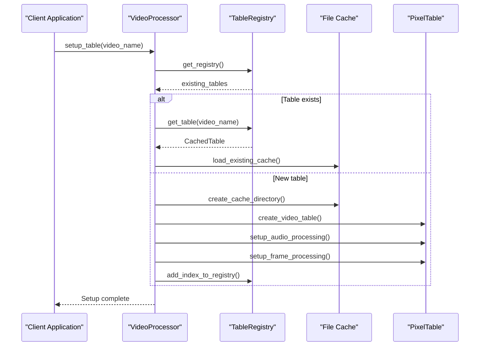
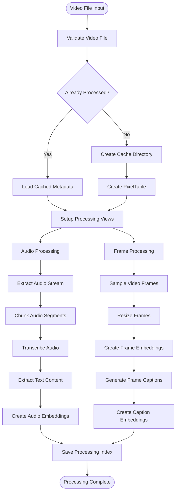
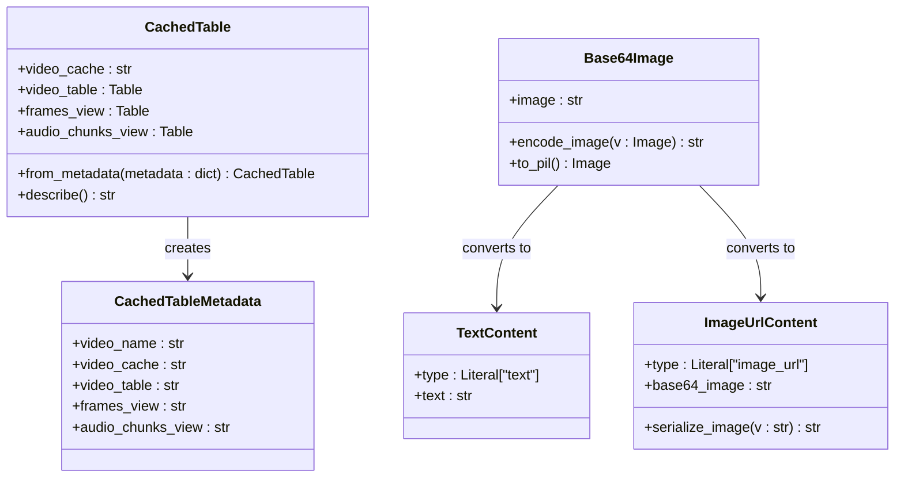
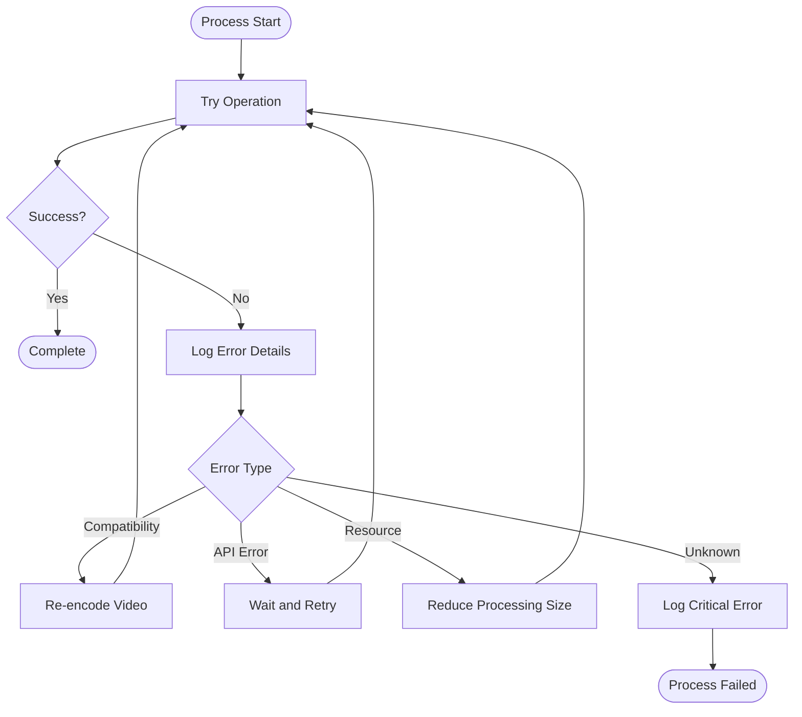
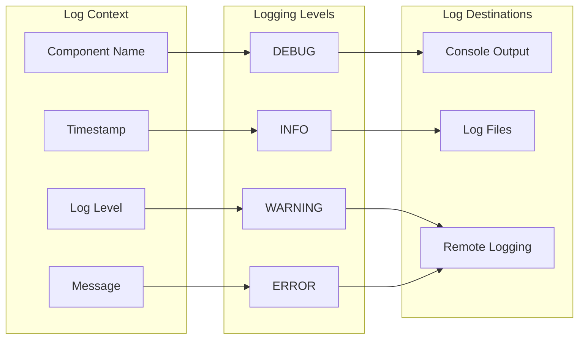

# Video Ingestion Pipeline

<cite>
**Referenced Files in This Document**
- [constants.py](file://vaas-mcp/src/vaas_mcp/video/ingestion/constants.py)
- [functions.py](file://vaas-mcp/src/vaas_mcp/video/ingestion/functions.py)
- [models.py](file://vaas-mcp/src/vaas_mcp/video/ingestion/models.py)
- [registry.py](file://vaas-mcp/src/vaas_mcp/video/ingestion/registry.py)
- [tools.py](file://vaas-mcp/src/vaas_mcp/video/ingestion/tools.py)
- [video_processor.py](file://vaas-mcp/src/vaas_mcp/video/ingestion/video_processor.py)
- [config.py](file://vaas-mcp/src/vaas_mcp/config.py)
- [tools.py](file://vaas-mcp/src/vaas_mcp/tools.py)
- [video_search_engine.py](file://vaas-mcp/src/vaas_mcp/video/video_search_engine.py)
- [video_ingestion_process.ipynb](file://vaas-mcp/notebooks/video_ingestion_process.ipynb)
</cite>

## Table of Contents
1. [Introduction](#introduction)
2. [Architecture Overview](#architecture-overview)
3. [Core Components](#core-components)
4. [Video Processing Workflow](#video-processing-workflow)
5. [Configuration and Constants](#configuration-and-constants)
6. [Data Models and Types](#data-models-and-types)
7. [External Tool Integration](#external-tool-integration)
8. [Error Handling and Recovery](#error-handling-and-recovery)
9. [Performance Considerations](#performance-considerations)
10. [Monitoring and Logging](#monitoring-and-logging)
11. [Usage Examples](#usage-examples)
12. [Troubleshooting Guide](#troubleshooting-guide)

## Introduction

The Video Ingestion Pipeline is a sophisticated system designed to process video files through multiple stages of analysis and indexing. Built on top of Pixeltable, this pipeline transforms raw video content into searchable multimedia assets by extracting audio, frames, captions, and embeddings. The system orchestrates complex operations involving FFmpeg for video processing, OpenAI models for transcription and vision tasks, and Hugging Face models for embeddings, creating a comprehensive multimedia database.

The pipeline serves as the foundation for the vaas-MCP video search capabilities, enabling agents to understand and interact with video content through multiple modalities including speech, images, and text. This documentation provides a comprehensive guide to the ingestion process, from initial file validation to final indexing and caching.

## Architecture Overview

The Video Ingestion Pipeline follows a modular architecture with clear separation of concerns across multiple layers:



**Diagram sources**
- [video_processor.py](file://vaas-mcp/src/vaas_mcp/video/ingestion/video_processor.py#L1-L50)
- [tools.py](file://vaas-mcp/src/vaas_mcp/video/ingestion/tools.py#L1-L50)

The architecture consists of four main layers:

1. **Input Layer**: Handles video file ingestion and preprocessing
2. **Processing Layer**: Orchestrates audio, frame, and text extraction
3. **Storage Layer**: Manages PixelTable storage and caching
4. **External Services**: Integrates with FFmpeg, OpenAI, and Hugging Face APIs

## Core Components

### VideoProcessor Class

The `VideoProcessor` class serves as the central orchestrator for the entire ingestion pipeline. It manages the complete lifecycle of video processing, from initialization to final indexing.



**Diagram sources**
- [video_processor.py](file://vaas-mcp/src/vaas_mcp/video/ingestion/video_processor.py#L20-L205)
- [models.py](file://vaas-mcp/src/vaas_mcp/video/ingestion/models.py#L15-L80)

### Registry Management

The registry system maintains persistent metadata about processed videos, enabling efficient lookup and reuse of previously processed content.



**Diagram sources**
- [video_processor.py](file://vaas-mcp/src/vaas_mcp/video/ingestion/video_processor.py#L40-L70)
- [registry.py](file://vaas-mcp/src/vaas_mcp/video/ingestion/registry.py#L20-L110)

**Section sources**
- [video_processor.py](file://vaas-mcp/src/vaas_mcp/video/ingestion/video_processor.py#L20-L205)
- [registry.py](file://vaas-mcp/src/vaas_mcp/video/ingestion/registry.py#L1-L110)

## Video Processing Workflow

The video ingestion process follows a structured workflow that ensures reliable processing and optimal performance:



**Diagram sources**
- [video_processor.py](file://vaas-mcp/src/vaas_mcp/video/ingestion/video_processor.py#L75-L205)

### Stage 1: Audio Processing

The audio processing stage extracts audio streams, segments them into manageable chunks, and generates transcriptions:

1. **Audio Extraction**: Uses Pixeltable's `extract_audio` function to separate audio from video
2. **Chunking**: Divides audio into overlapping segments using configurable chunk duration
3. **Transcription**: Employs OpenAI's GPT-4o-mini model for automatic speech recognition
4. **Text Extraction**: Processes transcription metadata to extract pure text content
5. **Embedding Creation**: Generates vector embeddings for semantic similarity search

### Stage 2: Frame Processing

The frame processing stage captures visual content and creates intelligent representations:

1. **Frame Sampling**: Extracts frames at configurable intervals using FPS-based sampling
2. **Image Processing**: Resizes frames to optimize memory usage and processing speed
3. **Visual Embeddings**: Creates CLIP embeddings for image similarity search
4. **Caption Generation**: Uses OpenAI vision models to generate descriptive captions
5. **Caption Embeddings**: Generates embeddings for textual similarity search

**Section sources**
- [video_processor.py](file://vaas-mcp/src/vaas_mcp/video/ingestion/video_processor.py#L80-L205)

## Configuration and Constants

The pipeline relies on a comprehensive configuration system that controls processing behavior and performance characteristics:

### Key Configuration Parameters

| Parameter | Default Value | Description |
|-----------|---------------|-------------|
| `SPLIT_FRAMES_COUNT` | 45 | Number of frames to extract per video |
| `AUDIO_CHUNK_LENGTH` | 10 | Audio chunk duration in seconds |
| `AUDIO_OVERLAP_SECONDS` | 1 | Overlap between audio chunks |
| `AUDIO_MIN_CHUNK_DURATION_SECONDS` | 1 | Minimum audio chunk length |
| `IMAGE_RESIZE_WIDTH` | 1024 | Maximum image width for processing |
| `IMAGE_RESIZE_HEIGHT` | 768 | Maximum image height for processing |
| `CAPTION_MODEL_PROMPT` | "Describe what is happening in the image" | Prompt for caption generation |

### Configuration Loading

The system uses Pydantic settings with environment variable support:

```python
class Settings(BaseSettings):
    # Video Ingestion Configuration
    SPLIT_FRAMES_COUNT: int = 45
    AUDIO_CHUNK_LENGTH: int = 10
    AUDIO_OVERLAP_SECONDS: int = 1
    AUDIO_MIN_CHUNK_DURATION_SECONDS: int = 1
    
    # Model Configuration
    AUDIO_TRANSCRIPT_MODEL: str = "gpt-4o-mini-transcribe"
    IMAGE_CAPTION_MODEL: str = "gpt-4o-mini"
    
    # Embedding Models
    TRANSCRIPT_SIMILARITY_EMBD_MODEL: str = "text-embedding-3-small"
    IMAGE_SIMILARITY_EMBD_MODEL: str = "openai/clip-vit-base-patch32"
    CAPTION_SIMILARITY_EMBD_MODEL: str = "text-embedding-3-small"
```

**Section sources**
- [config.py](file://vaas-mcp/src/vaas_mcp/config.py#L1-L56)
- [constants.py](file://vaas-mcp/src/vaas_mcp/video/ingestion/constants.py#L1-L2)

## Data Models and Types

The pipeline defines several key data models to manage metadata and ensure type safety:

### CachedTable Metadata



**Diagram sources**
- [models.py](file://vaas-mcp/src/vaas_mcp/video/ingestion/models.py#L15-L119)

### Processing Functions

The pipeline includes specialized UDFs (User Defined Functions) for common operations:

1. **Text Extraction**: Converts transcription JSON to plain text
2. **Image Resizing**: Maintains aspect ratio while fitting within bounds
3. **Base64 Encoding/Decoding**: Handles image data conversion

**Section sources**
- [models.py](file://vaas-mcp/src/vaas_mcp/video/ingestion/models.py#L1-L119)
- [functions.py](file://vaas-mcp/src/vaas_mcp/video/ingestion/functions.py#L1-L25)

## External Tool Integration

The pipeline integrates with several external tools and services to handle specialized processing tasks:

### FFmpeg Integration

FFmpeg serves as the primary video processing engine, handling:

- **Video Re-encoding**: Ensures compatibility with PyAV library
- **Audio Extraction**: Separates audio streams from video containers
- **Video Clipping**: Creates precise video segments for search results
- **Format Conversion**: Handles various video and audio formats

```python
def re_encode_video(video_path: str) -> str:
    """Re-encode video for PyAV compatibility"""
    command = ["ffmpeg", "-i", video_path, "-c", "copy", str(reencoded_video_path)]
    # ... execution logic
```

### OpenAI Model Integration

OpenAI models provide advanced AI capabilities:

- **Speech Recognition**: Automatic transcription of audio content
- **Vision Analysis**: Image caption generation and analysis
- **Text Embeddings**: Semantic similarity computation

### Hugging Face Integration

Hugging Face models enable advanced image processing:

- **CLIP Embeddings**: Visual similarity computation
- **Multimodal Analysis**: Cross-modal understanding capabilities

**Section sources**
- [tools.py](file://vaas-mcp/src/vaas_mcp/video/ingestion/tools.py#L1-L155)
- [video_processor.py](file://vaas-mcp/src/vaas_mcp/video/ingestion/video_processor.py#L1-L50)

## Error Handling and Recovery

The pipeline implements robust error handling and recovery mechanisms:

### Retry Mechanisms

While the current implementation doesn't include explicit retry loops, the system handles several types of failures gracefully:

1. **Video Compatibility Issues**: Automatic re-encoding using FFmpeg
2. **API Rate Limiting**: Graceful degradation and logging
3. **Memory Constraints**: Configurable chunk sizes and processing limits

### Failure Recovery Patterns



### Error Handling Strategies

1. **Graceful Degradation**: Continue processing with reduced functionality
2. **Caching**: Store partial results to enable resumption
3. **Logging**: Comprehensive error tracking for debugging
4. **Validation**: Pre-processing validation to prevent failures

**Section sources**
- [tools.py](file://vaas-mcp/src/vaas_mcp/video/ingestion/tools.py#L90-L155)

## Performance Considerations

The pipeline is designed with several performance optimization strategies:

### Chunking Strategies

- **Audio Chunks**: 10-second segments with 1-second overlap for seamless transitions
- **Frame Sampling**: Configurable FPS-based sampling to balance quality and performance
- **Memory Management**: Streaming processing to handle large video files efficiently

### Parallel Processing

The pipeline leverages Pixeltable's built-in parallelization:

- **Concurrent Embedding**: Generate embeddings for multiple chunks simultaneously
- **Batch Processing**: Process multiple video segments in parallel
- **Asynchronous Operations**: Non-blocking API calls to external services

### Resource Utilization

- **CPU Optimization**: Efficient video frame extraction and processing
- **Memory Management**: Configurable resizing to optimize memory usage
- **Disk I/O**: Intelligent caching to minimize redundant processing

### Scalability Features

- **Incremental Processing**: Process only new content in subsequent runs
- **Distributed Storage**: Support for cloud storage backends
- **Load Balancing**: Distribute processing across multiple workers

## Monitoring and Logging

The pipeline implements comprehensive logging and monitoring:

### Logging Architecture



### Key Logging Practices

1. **Structured Logging**: Consistent log format across all components
2. **Context Binding**: Component-specific logger binding for traceability
3. **Performance Tracking**: Timing information for critical operations
4. **Error Correlation**: Related errors linked through correlation IDs

### Monitoring Metrics

The system tracks several key metrics:

- **Processing Times**: Individual stage timing for performance analysis
- **Success Rates**: Processing completion rates by stage
- **Resource Usage**: Memory and CPU utilization during processing
- **Error Rates**: Frequency and types of processing failures

**Section sources**
- [video_processor.py](file://vaas-mcp/src/vaas_mcp/video/ingestion/video_processor.py#L25-L35)
- [tools.py](file://vaas-mcp/src/vaas_mcp/video/ingestion/tools.py#L10-L15)

## Usage Examples

### Basic Video Processing

```python
from vaas_mcp.video.ingestion.video_processor import VideoProcessor

# Initialize processor
processor = VideoProcessor()

# Setup and process video
video_path = "./videos/sample.mp4"
processor.setup_table(video_name=video_path)
processor.add_video(video_path=video_path)
```

### Using MCP Tools

```python
from vaas_mcp.tools import process_video, get_video_clip_from_user_query

# Process video for search
process_video("./videos/sample.mp4")

# Get relevant video clip
clip_path = get_video_clip_from_user_query(
    video_path="./videos/sample.mp4",
    user_query="What happens when they pass the butter?"
)
```

### Manual Processing Steps

The notebook demonstrates the complete manual processing workflow:

```python
# Create video table
video_table = pxt.create_table("test.videos", schema={"video": pxt.Video})

# Insert video
video_table.insert([{"video": video_path}])

# Extract audio
video_table.add_computed_column(
    audio=extract_audio(video_table.video, format="mp3")
)

# Create audio chunks view
audio_view = pxt.create_view(
    "test.audio_chunks",
    video_table,
    iterator=AudioSplitter.create(
        audio=video_table.audio,
        chunk_duration_sec=10.0,
        overlap_sec=1.0,
        min_chunk_duration_sec=1.0,
    )
)
```

**Section sources**
- [tools.py](file://vaas-mcp/src/vaas_mcp/tools.py#L1-L105)
- [video_ingestion_process.ipynb](file://vaas-mcp/notebooks/video_ingestion_process.ipynb#L1-L765)

## Troubleshooting Guide

### Common Issues and Solutions

#### Video Compatibility Problems

**Issue**: Videos fail to process with PyAV errors
**Solution**: The system automatically attempts re-encoding using FFmpeg

```python
# Automatic re-encoding handled internally
new_video_path = re_encode_video(video_path=video_path)
```

#### Memory Issues

**Issue**: Out of memory errors during processing
**Solutions**:
- Reduce `SPLIT_FRAMES_COUNT` in configuration
- Decrease `IMAGE_RESIZE_WIDTH` and `IMAGE_RESIZE_HEIGHT`
- Process smaller video segments

#### API Rate Limiting

**Issue**: OpenAI API rate limits exceeded
**Solutions**:
- Implement exponential backoff in client applications
- Increase processing batch sizes
- Use local alternatives for non-critical processing

#### Disk Space Issues

**Issue**: Insufficient disk space for caching
**Solutions**:
- Configure appropriate cache directories
- Implement cleanup policies for old caches
- Use cloud storage for large-scale deployments

### Debugging Techniques

1. **Enable Debug Logging**: Set log level to DEBUG for detailed operation traces
2. **Check Registry**: Verify cached table entries exist and are valid
3. **Validate Inputs**: Ensure video files are accessible and valid
4. **Monitor Resources**: Track memory and disk usage during processing

### Performance Optimization

1. **Profile Processing Times**: Identify bottlenecks in the pipeline
2. **Optimize Chunk Sizes**: Balance quality vs. processing speed
3. **Scale Infrastructure**: Add more processing capacity as needed
4. **Cache Strategy**: Implement intelligent caching for frequently accessed content

**Section sources**
- [tools.py](file://vaas-mcp/src/vaas_mcp/video/ingestion/tools.py#L90-L155)
- [video_processor.py](file://vaas-mcp/src/vaas_mcp/video/ingestion/video_processor.py#L190-L205)