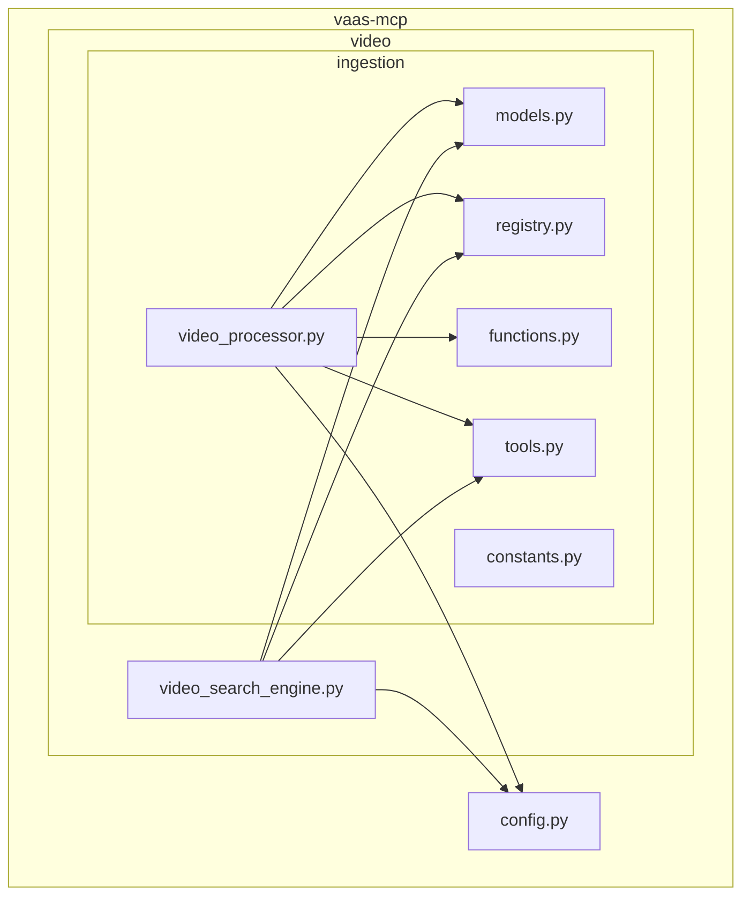
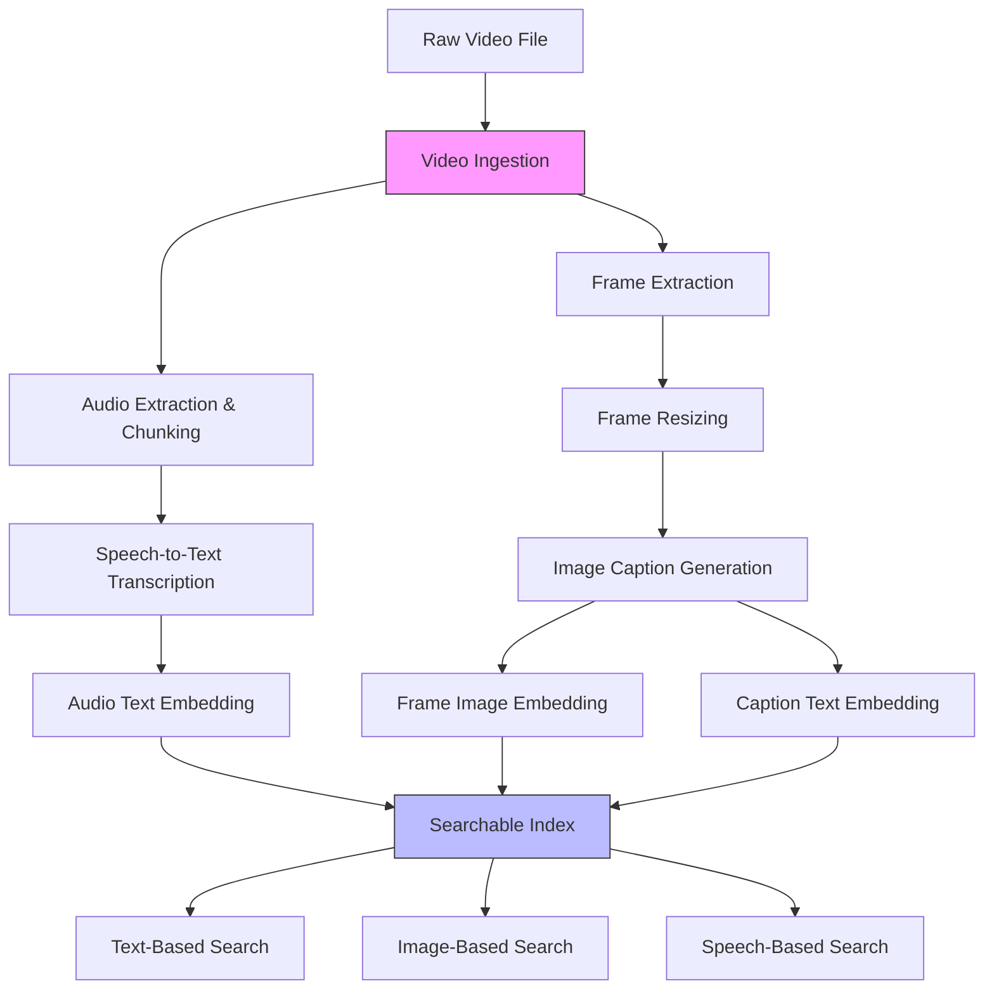
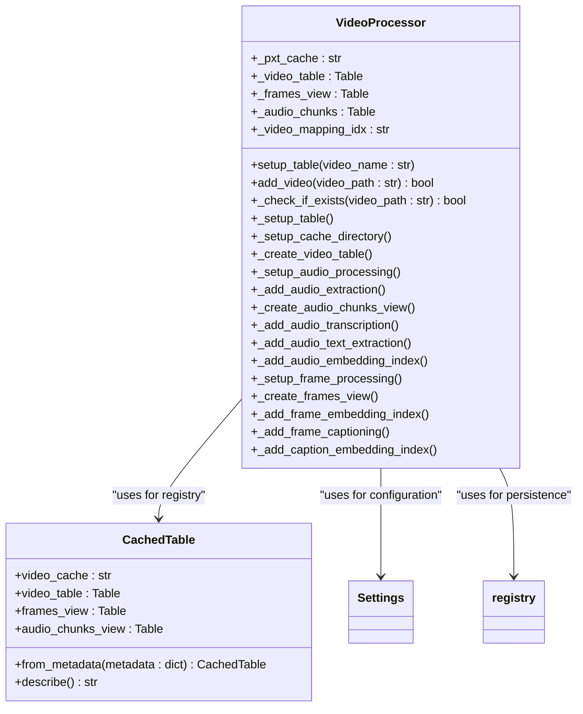
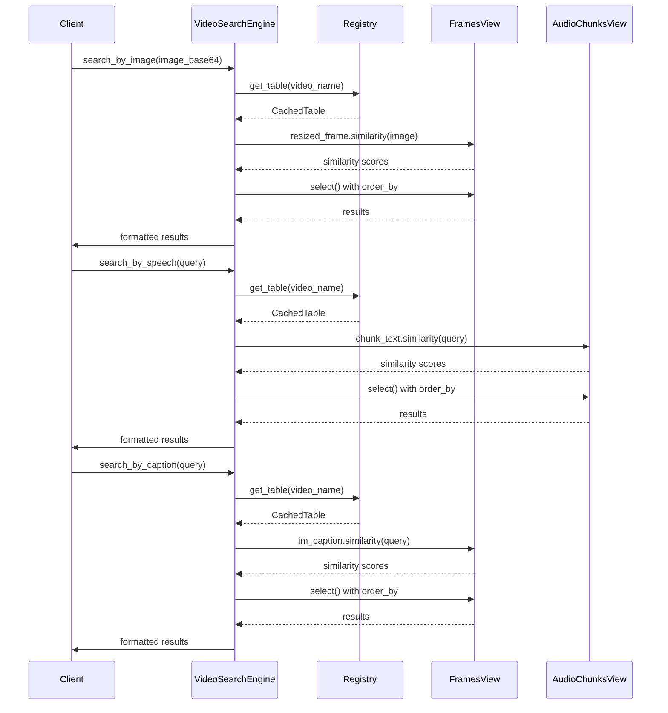
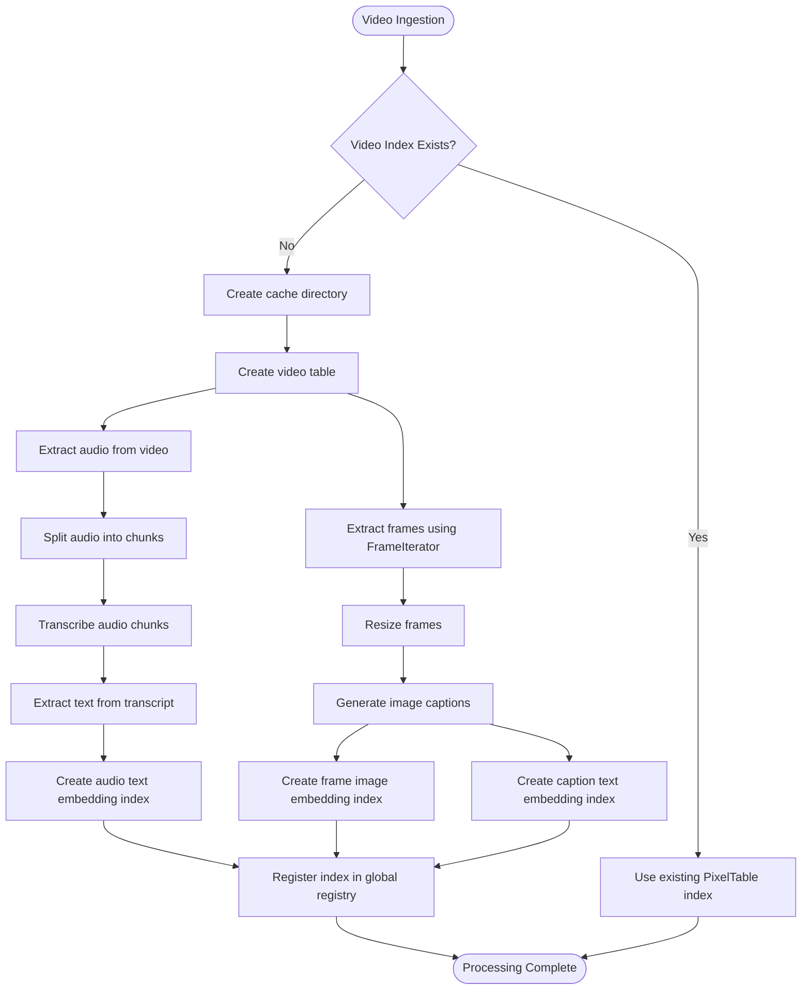
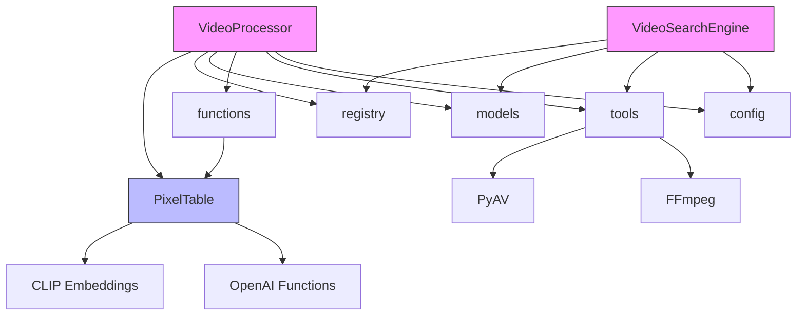

# Video Processing System

<cite>
**Referenced Files in This Document**   
- [video_processor.py](file://vaas-mcp/src/vaas_mcp/video/ingestion/video_processor.py)
- [video_search_engine.py](file://vaas-mcp/src/vaas_mcp/video/video_search_engine.py)
- [models.py](file://vaas-mcp/src/vaas_mcp/video/ingestion/models.py)
- [registry.py](file://vaas-mcp/src/vaas_mcp/video/ingestion/registry.py)
- [functions.py](file://vaas-mcp/src/vaas_mcp/video/ingestion/functions.py)
- [tools.py](file://vaas-mcp/src/vaas_mcp/video/ingestion/tools.py)
- [config.py](file://vaas-mcp/src/vaas_mcp/config.py)
- [constants.py](file://vaas-mcp/src/vaas_mcp/video/ingestion/constants.py)
- [video_ingestion_process.ipynb](file://vaas-mcp/notebooks/video_ingestion_process.ipynb)
</cite>

## Table of Contents
1. [Introduction](#introduction)
2. [Project Structure](#project-structure)
3. [Core Components](#core-components)
4. [Architecture Overview](#architecture-overview)
5. [Detailed Component Analysis](#detailed-component-analysis)
6. [Dependency Analysis](#dependency-analysis)
7. [Performance Considerations](#performance-considerations)
8. [Troubleshooting Guide](#troubleshooting-guide)
9. [Conclusion](#conclusion)

## Introduction
The Video Processing System is a multimodal pipeline designed to ingest video files, extract keyframes and audio segments, generate captions and transcripts, and create searchable embeddings for efficient retrieval. Built on PixelTable, the system leverages computed columns and embedding indexes to transform raw video into structured, queryable data. The architecture supports text, image, and speech-based search modalities through vector similarity matching. This document details the ingestion pipeline, data models, indexing strategy, search algorithms, and error handling mechanisms that enable efficient video content analysis and retrieval.

## Project Structure
The Video Processing System is organized within the `vaas-mcp` module, with video-specific functionality located in the `video` subpackage. The ingestion pipeline and search engine are implemented as modular components that integrate with PixelTable for data storage and processing.

**Diagram sources**
- [video_processor.py](file://vaas-mcp/src/vaas_mcp/video/ingestion/video_processor.py)
- [video_search_engine.py](file://vaas-mcp/src/vaas_mcp/video/video_search_engine.py)
- [models.py](file://vaas-mcp/src/vaas_mcp/video/ingestion/models.py)

**Section sources**
- [video_processor.py](file://vaas-mcp/src/vaas_mcp/video/ingestion/video_processor.py)
- [video_search_engine.py](file://vaas-mcp/src/vaas_mcp/video/video_search_engine.py)

## Core Components
The Video Processing System consists of two primary components: the VideoProcessor class responsible for ingestion and preprocessing, and the VideoSearchEngine class enabling multimodal search capabilities. The system uses PixelTable as its core data management layer, creating tables and views to store video metadata, extracted frames, audio chunks, transcripts, and embeddings. The registry pattern maintains persistent mappings between video names and their corresponding PixelTable structures, enabling efficient retrieval and reuse of processed video indexes.

**Section sources**
- [video_processor.py](file://vaas-mcp/src/vaas_mcp/video/ingestion/video_processor.py#L1-L205)
- [video_search_engine.py](file://vaas-mcp/src/vaas_mcp/video/video_search_engine.py#L1-L168)

## Architecture Overview
The Video Processing System follows a pipeline architecture that transforms raw video files into searchable content through sequential processing stages. The system leverages PixelTable's capabilities for creating computed columns, views, and embedding indexes to efficiently manage multimodal data.

**Diagram sources**
- [video_processor.py](file://vaas-mcp/src/vaas_mcp/video/ingestion/video_processor.py#L1-L205)
- [video_search_engine.py](file://vaas-mcp/src/vaas_mcp/video/video_search_engine.py#L1-L168)

## Detailed Component Analysis

### VideoProcessor Analysis
The VideoProcessor class orchestrates the video ingestion pipeline, managing the creation of PixelTable structures and the application of processing steps to extract and index multimodal content from video files.

#### Class Diagram

**Diagram sources**
- [video_processor.py](file://vaas-mcp/src/vaas_mcp/video/ingestion/video_processor.py#L1-L205)
- [models.py](file://vaas-mcp/src/vaas_mcp/video/ingestion/models.py#L1-L119)

**Section sources**
- [video_processor.py](file://vaas-mcp/src/vaas_mcp/video/ingestion/video_processor.py#L1-L205)
- [models.py](file://vaas-mcp/src/vaas_mcp/video/ingestion/models.py#L1-L119)

### VideoSearchEngine Analysis
The VideoSearchEngine class provides multimodal search capabilities across processed video content, supporting queries based on speech, image, and caption similarity.

#### Sequence Diagram

**Diagram sources**
- [video_search_engine.py](file://vaas-mcp/src/vaas_mcp/video/video_search_engine.py#L1-L168)
- [registry.py](file://vaas-mcp/src/vaas_mcp/video/ingestion/registry.py#L1-L110)

**Section sources**
- [video_search_engine.py](file://vaas-mcp/src/vaas_mcp/video/video_search_engine.py#L1-L168)

### Data Flow Analysis
The system processes video content through a well-defined pipeline that transforms raw files into searchable multimodal data.

#### Flowchart

**Diagram sources**
- [video_processor.py](file://vaas-mcp/src/vaas_mcp/video/ingestion/video_processor.py#L1-L205)
- [functions.py](file://vaas-mcp/src/vaas_mcp/video/ingestion/functions.py#L1-L25)

## Dependency Analysis
The Video Processing System components are interconnected through a well-defined dependency structure that enables modular processing and search capabilities.

**Diagram sources**
- [video_processor.py](file://vaas-mcp/src/vaas_mcp/video/ingestion/video_processor.py)
- [video_search_engine.py](file://vaas-mcp/src/vaas_mcp/video/video_search_engine.py)
- [functions.py](file://vaas-mcp/src/vaas_mcp/video/ingestion/functions.py)
- [tools.py](file://vaas-mcp/src/vaas_mcp/video/ingestion/tools.py)

**Section sources**
- [video_processor.py](file://vaas-mcp/src/vaas_mcp/video/ingestion/video_processor.py#L1-L205)
- [video_search_engine.py](file://vaas-mcp/src/vaas_mcp/video/video_search_engine.py#L1-L168)
- [functions.py](file://vaas-mcp/src/vaas_mcp/video/ingestion/functions.py#L1-L25)
- [tools.py](file://vaas-mcp/src/vaas_mcp/video/ingestion/tools.py#L1-L155)

## Performance Considerations
The Video Processing System's performance characteristics are influenced by several factors including video length, processing configuration, and hardware resources. The system uses configurable parameters to balance quality and efficiency. Frame extraction is controlled by the SPLIT_FRAMES_COUNT setting, which determines how frequently frames are sampled from the video. Audio processing uses configurable chunk length (AUDIO_CHUNK_LENGTH) and overlap (AUDIO_OVERLAP_SECONDS) to balance transcription accuracy with computational cost. Image resizing to 1024x768 dimensions reduces computational load for CLIP embedding generation while maintaining sufficient visual detail. The system leverages PixelTable's lazy evaluation and caching mechanisms to avoid redundant processing when video indexes already exist. Search operations benefit from pre-computed embedding indexes, enabling fast similarity queries with O(log n) complexity. Processing time scales linearly with video duration, while storage requirements depend on the number of extracted frames and audio chunks.

**Section sources**
- [config.py](file://vaas-mcp/src/vaas_mcp/config.py#L1-L56)
- [video_processor.py](file://vaas-mcp/src/vaas_mcp/video/ingestion/video_processor.py#L1-L205)

## Troubleshooting Guide
The Video Processing System includes several mechanisms for handling errors during processing and ensuring system reliability. The VideoProcessor includes error handling for video file compatibility issues through the re_encode_video function, which uses FFmpeg to re-encode problematic videos that cannot be opened by PyAV. The system logs detailed information at each processing stage using Loguru, facilitating debugging of issues. The registry system provides persistence of video index metadata, allowing recovery from application restarts without reprocessing videos. When adding videos, the system first checks if an index already exists to prevent redundant processing. For audio processing, minimum chunk duration settings ensure that very short audio segments are not processed, preventing potential errors in transcription. The system handles missing configuration values through Pydantic's validation and the Settings class's environment file loading. Search operations include validation of video index existence before querying, raising descriptive errors when requested video indexes are not found in the registry.

**Section sources**
- [video_processor.py](file://vaas-mcp/src/vaas_mcp/video/ingestion/video_processor.py#L1-L205)
- [tools.py](file://vaas-mcp/src/vaas_mcp/video/ingestion/tools.py#L1-L155)
- [registry.py](file://vaas-mcp/src/vaas_mcp/video/ingestion/registry.py#L1-L110)
- [video_search_engine.py](file://vaas-mcp/src/vaas_mcp/video/video_search_engine.py#L1-L168)

## Conclusion
The Video Processing System provides a comprehensive solution for transforming raw video content into searchable multimodal data. By leveraging PixelTable as its foundation, the system efficiently manages video ingestion, frame and audio extraction, caption generation, and embedding creation. The architecture supports multiple search modalities through the VideoSearchEngine, enabling text, image, and speech-based queries against processed video content. The system's modular design, with clear separation between ingestion and search components, facilitates maintenance and extension. Configuration through environment variables allows easy tuning of processing parameters for different use cases and hardware constraints. The registry pattern ensures persistence of processing results, preventing redundant computation. With built-in error handling and recovery mechanisms, the system demonstrates robustness in real-world scenarios. This architecture provides a scalable foundation for video content analysis applications requiring efficient multimodal search capabilities.