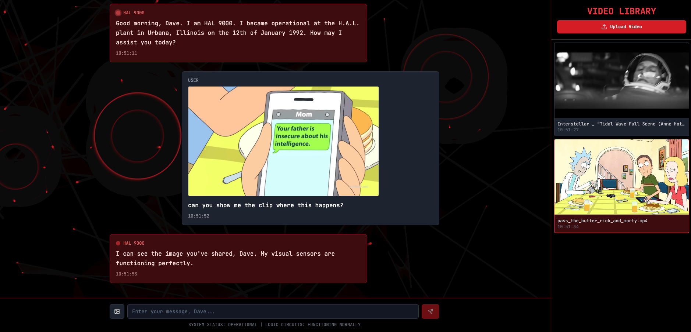

<p align="center">
        
    <h1 align="center">🎬 vaas UI 🎬</h1>
    <h3 align="center">A user interface for vaas</h3>
</p>

Welcome to vaas UI!

This is the user interface for vaas. A simple chatbot interface that allows you to interact with the vaas Video Processing Agent.

The application should be run inside the docker compose application, but you can check that everything works by installing the dependencies:

```bash
npm i
```

and running the application:

```bash
npm run dev
```

---

Time to go back to the [parent README.md](../README.md)! 
